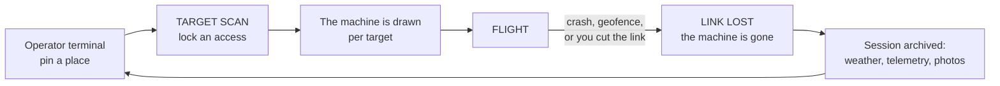

FPV drone flying over real cities, in the browser. The scenery is photogrammetry
pulled from Google Earth, so it's the actual geometry and textures of a place
that exists. The flight model is a Betaflight quad, acro by default, and a radio
is recognised without setup.

https://github.com/user-attachments/assets/d18df585-a85d-484f-8743-3dce02777d50

## Play

[Download the latest release](https://github.com/lionrayonnant/FPVThePlanet/releases/latest):
a `.exe` installer for Windows, an `.AppImage` for Linux. Both update themselves.

To run from source you need Node 22 and a WebGL2 browser. Chromium is the safe
choice, because its Gamepad API picks up a radio as soon as you move a stick.

```bash
git clone --depth 1 https://github.com/lionrayonnant/FPVThePlanet.git
cd FPVThePlanet/sim && npm install && npm run dev   # http://localhost:5173
```

The clone is around 165 MB, nine tenths of it the 143 music tracks in
`sim/public/music/`. `--depth 1` skips the history; the audio it does not skip,
because the soundtrack is part of the game rather than an asset pack.

A fresh clone has no terrain on disk, so the catalogue starts empty. Open the
LIVE tab, click the map to drop a pin, then `[ FLY LIVE ]`. Tiles stream in
during the flight and nothing is written to your disk.

Controls: a USB gamepad or radio is detected automatically in Mode 2, and you
can remap and calibrate it under `Tab`, with live bars to identify each axis. On
the keyboard, `W`/`S` is throttle, `A`/`D` is yaw, the arrows or the mouse do
roll and pitch, `M` switches flight mode (acro, angle, altitude), `C` is the
free camera, `T` flips the machine back over, `Tab` opens settings.

Acro is the default, on a keyboard as much as on a radio — the keyboard axes
ramp rather than snapping to full deflection, which is what makes that
survivable without a stick. `M` cycles to angle and altitude if you want them.
There is no respawn in FIELD: crash and the machine is gone, and you start a
new one. BENCH is the mode where nothing is lost.

## How it works



Terrain is expensive, so it's cached and reused. The drone isn't: it's generated
for each target and lost on a crash. There is no respawn in FIELD mode, and
BENCH is the exception where nothing is lost.


Tiles come from Google Earth's internal `rocktree` protocol, which needs no key
and no account. In LIVE mode the player's own browser fetches them, so they
never pass through a server and nothing is kept.

Acquisition is the other path: downloading an area and baking it to playable
terrain on disk. It is off by default. It only turns on with `FPVTP_ACQUIRE=1`
in the environment, and never in `--mode shared`. CI doesn't set it and neither
do the distributed builds. The imagery stays © Google and is never
redistributed, so every install downloads its own and no baked terrain ships
from here.

## Built with

Plain JavaScript, no transpiler. Three.js for rendering, Rapier (WASM) for
physics, Vite for development and builds, Electron for the desktop app. The
standalone server is `node:http` with no dependencies.

The air model lives in `sim/src/quad.js` (mass, inertia, motor lag, blade drag,
ground effect, propwash, battery sag) and the controller in
`sim/src/flightController.js`. PID gains are measured with `npm run tune`.

| | |
|---|---|
| `npm run dev` | development: Vite, hot reload |
| `npm run build` then `node server/index.mjs --dist dist --open` | the game served without Vite, which is also what runs on a server |
| `npm run build` then `npx electron-builder` | the desktop app (`.exe`, `.AppImage`), with auto-update. The build step is not optional: electron-builder packages `dist/` as it finds it, and `dist/` is gitignored, so skipping it ships whatever bundle was last built |
| `npm run selftest:ci` | the full chain: 2,700+ checks, no browser, no network, no terrain |

## Read on

| | |
|---|---|
| [`docs/manual.md`](docs/manual.md) | commands, adding maps, the prep pipeline, the flight model, PID tuning |
| [`sim/docs/architecture-diagrams.md`](sim/docs/architecture-diagrams.md) | six more diagrams of the running system |
| [`deploy/README.md`](deploy/README.md) | putting the server on a machine |
| [`CHANGELOG.md`](CHANGELOG.md) | what changed, version by version |
| [`CONTRIBUTING.md`](CONTRIBUTING.md) | how the project works, and the rules that actually bite |
| [`sim/HANDOFF.md`](sim/HANDOFF.md) | the maintainer's working log: what is measured, what is not. Internal, and still largely in French |

## License

Copyright © 2026 lionrayonnant. [GNU AGPL-3.0-only](LICENSE). The code is free,
and anyone hosting a modified version for other people has to publish their
sources.

Bundled third-party work keeps its own licence: [Three.js](https://threejs.org/),
[Rapier](https://rapier.rs/), [Leaflet](https://leafletjs.com/) and
[Leaflet-Geoman](https://geoman.io/leaflet-geoman), all listed in
`sim/package.json`. The IBM Plex Mono and Departure Mono fonts are under the SIL
Open Font License, whose text sits next to them in `sim/public/fonts/`. The
music in `sim/public/music/` was generated for this project. Map tiles are
© OpenStreetMap and place search is © Nominatim.

## Support

The game is free and stays free. Nothing in it is paywalled, counted, or
remembered about you. If it gave you something, there is a `SUPPORT` line under
the terminal footer, and the same addresses are here:

| | |
|---|---|
| one line, any coin | `fpvtp@cake.cash` |
| Monero | `42RnnFdtNasaiUQGEASPGRXjHcr2pDocwXCwGUAhwyp7KbAhbKwCHrEfeYMkUMpo7gQdEABWy9LoRd4iEUFMq2SXKdHPqKt` |
| Bitcoin, silent payment | `sp1qq2tuvemuzgu6hudsu7jf2h90gl6xemav67s3x3f34l76qtfl6dzgcq43r30lvckcz4qat2x8ju5a36sdqr2r3fe72cqpudvlqh797agdkcvkvkl4` |
| Bitcoin | `bc1qmwm3rcvzkwaft40yrtynym3yww20t2atfr45yg` |

Crypto only, and not out of enthusiasm: every card rail verifies the identity of
whoever receives the money, and this project is published under a pseudonym.

These addresses live in `sim/tools/support-model.mjs`, and
`sim/tools/support-selftest.mjs` re-verifies every one of them by checksum on
every CI run — bech32 and bech32m for Bitcoin, Keccak-256 for Monero. A typo in
a caption is embarrassing; a typo in an address sends a stranger's money
somewhere nobody can spend it.

## Contributions

Still reading? Contributions are welcome.

[`CONTRIBUTING.md`](CONTRIBUTING.md) is the short version of how the project
works — how to get it running, the module boundaries that keep the flight stack
testable, and the three or four rules a pull request actually gets sent back
for. Open an issue before anything larger than a fix; the target experience and
the order it gets built in are already written down, and a described problem is
often already answered by something planned.

Questions, tuning talk and "is this supposed to work like that" belong in
[Discussions](https://github.com/lionrayonnant/FPVThePlanet/discussions).
Vulnerabilities go through [`SECURITY.md`](SECURITY.md), never a public issue.
Everyone taking part is held to the [Code of Conduct](CODE_OF_CONDUCT.md).
