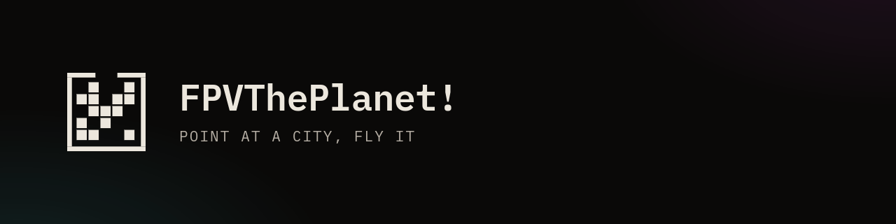
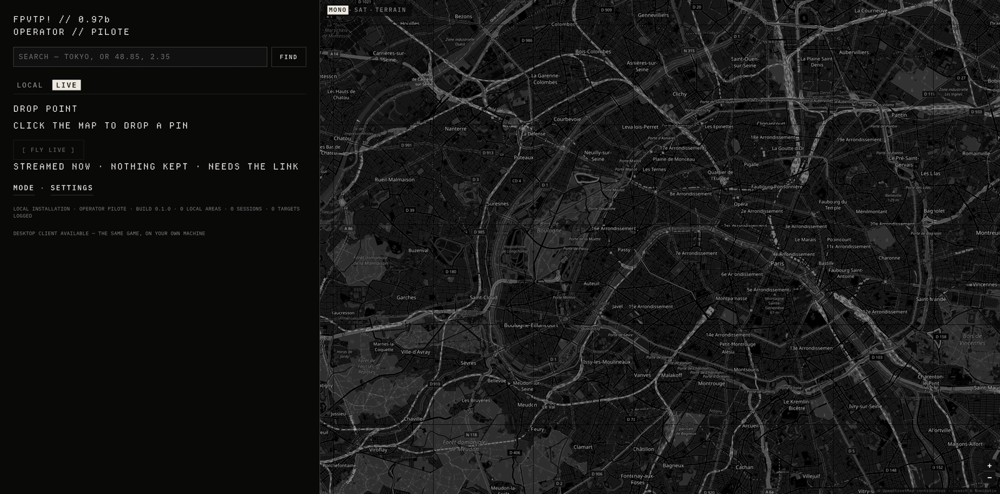

# FPVThePlanet!

**Voler en FPV au-dessus de vraies villes, dans le navigateur.** Le décor n'est
pas modélisé : c'est de la photogrammétrie 3D, la géométrie et les textures d'un
lieu qui existe. Le pilotage est celui d'un quad Betaflight — acro par défaut,
manette reconnue toute seule.



Autour du vol il y a un jeu : un terminal d'opérateur où l'on épingle un lieu,
scanne une cible, décroche un accès, vole, se pose — et retrouve la session dans
une archive qui se relit, avec sa météo, sa télémétrie et ses captures.

## Démarrer

Il faut **Node 22** et un navigateur qui fait du WebGL2 (Chrome ou Chromium
recommandé : sa Gamepad API reconnaît une radio dès qu'on bouge un manche).

```bash
git clone https://github.com/lionrayonnant/FPVThePlanet.git
cd FPVThePlanet/sim
npm install
npm run dev          # http://localhost:5173
```

**Ce que tu peux faire tout de suite :** un dépôt fraîchement cloné n'a aucun
terrain sur disque — le catalogue commence vide, c'est normal. Va sur l'onglet
**LIVE**, clique la carte pour poser une épingle, `[ FLY LIVE ]`. Les tuiles
arrivent en direct pendant le vol, rien n'est écrit sur ton disque.

L'autre voie — télécharger une zone pour la garder et voler hors ligne — est
**fermée par défaut** ; voir « D'où vient le terrain » plus bas.

### Piloter

**Manette / radio USB** : détectée automatiquement, Mode 2 par défaut,
remappable et calibrable dans `Tab`, avec des barres en direct pour identifier
chaque axe.

**Clavier** : `W`/`S` gaz · `A`/`D` lacet · flèches ou souris roulis-tangage ·
`R` respawn · `M` mode (acro / angle / altitude) · `C` caméra libre ·
`Tab` réglages.

## Les trois façons de le faire tourner

| | |
|---|---|
| `npm run dev` | le développement : Vite, rechargement à chaud |
| `npm run build` puis `node server/index.mjs --dist dist --open` | le jeu servi pour de vrai, sans Vite — c'est aussi ce qui tourne sur un serveur |
| `npx electron-builder` | une application installée (`.exe` NSIS, `.AppImage`), avec mise à jour automatique |

Le serveur autonome écoute sur `127.0.0.1` et **refuse** une autre adresse tant
qu'on ne lui passe pas `--mode shared` — auquel cas il réclame une clé
d'opérateur à chaque requête. `deploy/` contient de quoi le mettre derrière
Caddy sur une machine louée.

`npm run build` enchaîne `vite build` et `node sim/tools/precompress.mjs` : un
`.br` et un `.gz` à côté de chaque fichier texte du build, que le serveur
autonome sert avec `Content-Encoding` (jamais sur un `Range`, une ETag par
représentation). Rapier et `three` ont leur propre chunk, en cache d'une
version à l'autre ; le menu n'attend plus le WASM de Rapier. En vol LIVE, la
fenêtre de streaming charge par anneaux de niveau de détail
(`sim/tools/lib/rocktree/lod.mjs`), garde ses bulks dans le worker de
traversée et persiste bulks et nœuds sur disque (Cache API,
`sim/src/rocktree-cache.js`, vidable depuis DevTools → Application → Cache
Storage → `fpvtp-rocktree-v1`).

## D'où vient le terrain

Les tuiles viennent de Google Earth, par son protocole interne `rocktree`
(`sim/tools/lib/providers/google-earth.mjs`) : pas de clé, pas de compte. En
mode LIVE, c'est le navigateur du joueur qui va les chercher — elles ne
transitent jamais par un serveur, et rien n'est conservé.

**L'acquisition** — télécharger une zone, la décoder et l'écrire sur disque
comme terrain jouable — est autre chose, et elle est **fermée par défaut**. Elle
ne s'ouvre qu'avec `FPVTP_ACQUIRE=1` dans l'environnement, et jamais en
`--mode shared`, quoi qu'il arrive :

```bash
FPVTP_ACQUIRE=1 npm run dev     # [ DRAW BOX ] et [ ACQUIRE AREA ] réapparaissent
```

Ni l'intégration continue ni les applications construites pour être distribuées
ne posent cette variable. L'imagerie reste © Google et n'est jamais
redistribuée : chaque installation télécharge la sienne, et aucun terrain cuit
n'est publié ici.

## Comment c'est fait

JavaScript sans transpileur. **Three.js** pour le rendu, **Rapier** (WASM) pour
la physique, **Vite** pour le développement et le build, **Electron** pour
l'application installée. Le serveur est du `node:http` nu — aucune dépendance.

Le modèle de vol vit dans `sim/src/quad.js` (masse, inertie, retard moteur,
traînée de pale, effet de sol, propwash, affaissement de batterie) et le
contrôleur dans `sim/src/flightController.js`. Les gains ne sont pas devinés :
ils se mesurent avec `npm run tune`.

```bash
npm run selftest:ci     # la chaîne complète : ~1 200 vérifications, sans navigateur
```

## Où lire la suite

| | |
|---|---|
| [`docs/manual.md`](docs/manual.md) | commandes, ajout de cartes, pré-traitement, modèle de vol, réglage du PID |
| [`sim/HANDOFF.md`](sim/HANDOFF.md) | ce qui est vérifié, et surtout ce qui ne l'est pas |
| [`sim/docs/`](sim/docs/) | direction artistique, feuille de route, spécifications de conception |
| [`deploy/README.md`](deploy/README.md) | installer le serveur sur une machine |
| [`CHANGELOG.md`](CHANGELOG.md) | ce qui a changé, version par version |

## Licence

[GNU AGPL-3.0-only](LICENSE). En clair : le code est libre, et quiconque héberge
une version modifiée pour d'autres personnes doit en publier les sources.

Ce qui est embarqué et vient d'ailleurs, sous sa propre licence :
[Three.js](https://threejs.org/), [Rapier](https://rapier.rs/),
[Leaflet](https://leafletjs.com/) et
[Leaflet-Geoman](https://geoman.io/leaflet-geoman) (voir `sim/package.json`) ;
les fontes **IBM Plex Mono** et **Departure Mono** sous SIL Open Font License,
dont le texte voyage avec elles dans `sim/public/fonts/` ; la musique de
`sim/public/music/`, générée pour ce projet ; les fonds de carte
© OpenStreetMap, la recherche de lieux © Nominatim.
