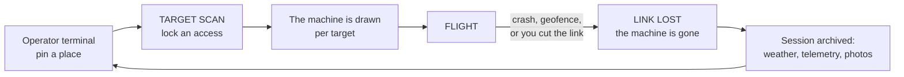

# FPVThePlanet!

FPV drone flying over real cities, in the browser. The scenery is photogrammetry
pulled from Google Earth, so it's the actual geometry and textures of a place
that exists. The flight model is a Betaflight quad, acro by default, and a radio
is recognised without setup.

<!-- TRAILER: replace TODO with the video URL, and swap the thumbnail for a
     frame exported from the edit. -->
[](TODO)

## Play

[Download the latest release](https://github.com/lionrayonnant/FPVThePlanet/releases/latest):
a `.exe` installer for Windows, an `.AppImage` for Linux. Both update themselves.

To run from source you need Node 22 and a WebGL2 browser. Chromium is the safe
choice, because its Gamepad API picks up a radio as soon as you move a stick.

```bash
git clone https://github.com/lionrayonnant/FPVThePlanet.git
cd FPVThePlanet/sim && npm install && npm run dev   # http://localhost:5173
```

A fresh clone has no terrain on disk, so the catalogue starts empty. Open the
LIVE tab, click the map to drop a pin, then `[ FLY LIVE ]`. Tiles stream in
during the flight and nothing is written to your disk.

Controls: a USB gamepad or radio is detected automatically in Mode 2, and you
can remap and calibrate it under `Tab`, with live bars to identify each axis. On
the keyboard, `W`/`S` is throttle, `A`/`D` is yaw, the arrows or the mouse do
roll and pitch, `R` respawns, `M` switches flight mode (acro, angle, altitude),
`C` is the free camera, `Tab` opens settings.

## How it works



Terrain is expensive, so it's cached and reused. The drone isn't: it's generated
for each target and lost on a crash. There is no respawn in FIELD mode, and
BENCH is the exception where nothing is lost.


Tiles come from Google Earth's internal `rocktree` protocol, which needs no key
and no account. In LIVE mode the player's own browser fetches them, so they
never pass through a server and nothing is kept.

Acquisition is the other path: downloading an area and baking it to playable
terrain on disk. It is off by default. It only turns on with `FPVTP_ACQUIRE=1`
in the environment, and never in `--mode shared`. CI doesn't set it and neither
do the distributed builds. The imagery stays © Google and is never
redistributed, so every install downloads its own and no baked terrain ships
from here.

## Built with

Plain JavaScript, no transpiler. Three.js for rendering, Rapier (WASM) for
physics, Vite for development and builds, Electron for the desktop app. The
standalone server is `node:http` with no dependencies.

The air model lives in `sim/src/quad.js` (mass, inertia, motor lag, blade drag,
ground effect, propwash, battery sag) and the controller in
`sim/src/flightController.js`. PID gains are measured with `npm run tune`.

| | |
|---|---|
| `npm run dev` | development: Vite, hot reload |
| `npm run build` then `node server/index.mjs --dist dist --open` | the game served without Vite, which is also what runs on a server |
| `npx electron-builder` | the desktop app (`.exe`, `.AppImage`), with auto-update |
| `npm run selftest:ci` | the full chain: ~1,200 checks, no browser |

## Read on

| | |
|---|---|
| [`docs/manuel.md`](docs/manuel.md) | commands, adding maps, the prep pipeline, the flight model, PID tuning |
| [`sim/docs/architecture-diagrams.md`](sim/docs/architecture-diagrams.md) | six more diagrams of the running system |
| [`sim/HANDOFF.md`](sim/HANDOFF.md) | what's verified and what isn't |
| [`deploy/README.md`](deploy/README.md) | putting the server on a machine |
| [`CHANGELOG.md`](CHANGELOG.md) | what changed, version by version |

## License

[GNU AGPL-3.0-only](LICENSE). The code is free, and anyone hosting a modified
version for other people has to publish their sources.

Bundled third-party work keeps its own licence: [Three.js](https://threejs.org/),
[Rapier](https://rapier.rs/), [Leaflet](https://leafletjs.com/) and
[Leaflet-Geoman](https://geoman.io/leaflet-geoman), all listed in
`sim/package.json`. The IBM Plex Mono and Departure Mono fonts are under the SIL
Open Font License, whose text sits next to them in `sim/public/fonts/`. The
music in `sim/public/music/` was generated for this project. Map tiles are
© OpenStreetMap and place search is © Nominatim.
