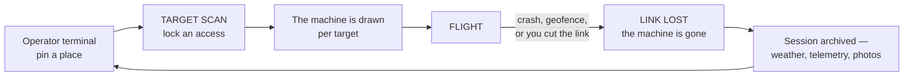
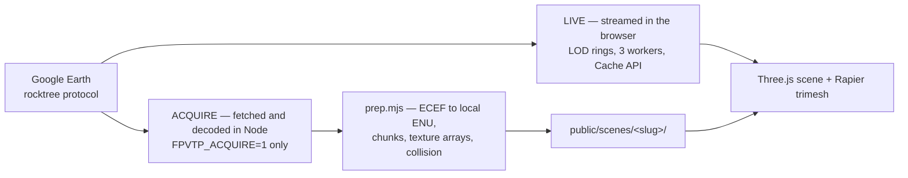

# FPVThePlanet!

**Fly FPV over real cities, in your browser.** The scenery is not modelled: it is
3D photogrammetry, the geometry and textures of a place that exists. The flying
is a Betaflight quad — acro by default, radio recognised on its own.

<!-- TRAILER — replace the `TODO` href with the video URL, and swap the
     thumbnail for a frame exported from the edit (or maxresdefault.jpg). -->
[](TODO)

## Play

**[Download the latest release](https://github.com/lionrayonnant/FPVThePlanet/releases/latest)**
— a `.exe` installer for Windows, an `.AppImage` for Linux, both self-updating.

From source you need **Node 22** and a WebGL2 browser (Chromium recommended: its
Gamepad API picks up a radio as soon as you move a stick).

```bash
git clone https://github.com/lionrayonnant/FPVThePlanet.git
cd FPVThePlanet/sim && npm install && npm run dev   # http://localhost:5173
```

A fresh clone has no terrain on disk and the catalogue starts empty — that is
normal. Open the **LIVE** tab, click the map to drop a pin, `[ FLY LIVE ]`:
tiles arrive during the flight and nothing is written to your disk.

**Controls.** A USB gamepad or radio is detected automatically — Mode 2,
remappable and calibratable under `Tab`, with live bars to identify each axis.
Keyboard: `W`/`S` throttle · `A`/`D` yaw · arrows or mouse for roll and pitch ·
`R` respawn · `M` mode (acro / angle / altitude) · `C` free camera · `Tab`
settings.

## How it works



The world persists, the machine does not. Terrain is heavy, expensive and kept;
the drone is free, drawn per target, lost on crash.



Tiles come from Google Earth's internal `rocktree` protocol — no key, no
account. In LIVE it is the player's own browser that fetches them: they never
pass through a server and nothing is kept. **Acquisition** — downloading an area
and baking it to playable terrain on disk — is another matter, and is **closed
by default**: it only opens with `FPVTP_ACQUIRE=1` in the environment, and never
in `--mode shared`. Neither CI nor the distributed applications set it. The
imagery stays © Google and is never redistributed: every install downloads its
own, and no baked terrain is published here.

## Built with

Plain JavaScript, no transpiler. **Three.js** for rendering, **Rapier** (WASM)
for physics, **Vite** for development and the build, **Electron** for the
installed app. The standalone server is bare `node:http` — zero dependencies.
Flight lives in `sim/src/quad.js` (mass, inertia, motor lag, blade drag, ground
effect, propwash, battery sag) and `sim/src/flightController.js`; the gains are
measured with `npm run tune`, never guessed.

| | |
|---|---|
| `npm run dev` | development: Vite, hot reload |
| `npm run build` then `node server/index.mjs --dist dist --open` | the game served for real, without Vite — also what runs on a server |
| `npx electron-builder` | the installed app (`.exe`, `.AppImage`), with auto-update |
| `npm run selftest:ci` | the full chain: ~1,200 checks, no browser |

## Read on

| | |
|---|---|
| [`docs/manuel.md`](docs/manuel.md) | commands, adding maps, the prep pipeline, the flight model, PID tuning |
| [`sim/docs/architecture-diagrams.md`](sim/docs/architecture-diagrams.md) | six more diagrams of the running system |
| [`sim/HANDOFF.md`](sim/HANDOFF.md) | what is verified, and above all what is not |
| [`deploy/README.md`](deploy/README.md) | putting the server on a machine |
| [`CHANGELOG.md`](CHANGELOG.md) | what changed, version by version |

## License

[GNU AGPL-3.0-only](LICENSE). Plainly: the code is free, and anyone hosting a
modified version for other people must publish their sources.

Bundled third-party work keeps its own licence: [Three.js](https://threejs.org/),
[Rapier](https://rapier.rs/), [Leaflet](https://leafletjs.com/) and
[Leaflet-Geoman](https://geoman.io/leaflet-geoman) (see `sim/package.json`); the
**IBM Plex Mono** and **Departure Mono** fonts under the SIL Open Font License,
whose text travels with them in `sim/public/fonts/`; the music in
`sim/public/music/`, generated for this project; map tiles © OpenStreetMap,
place search © Nominatim.
