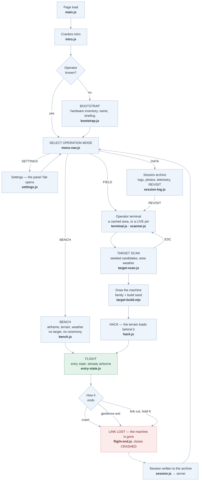
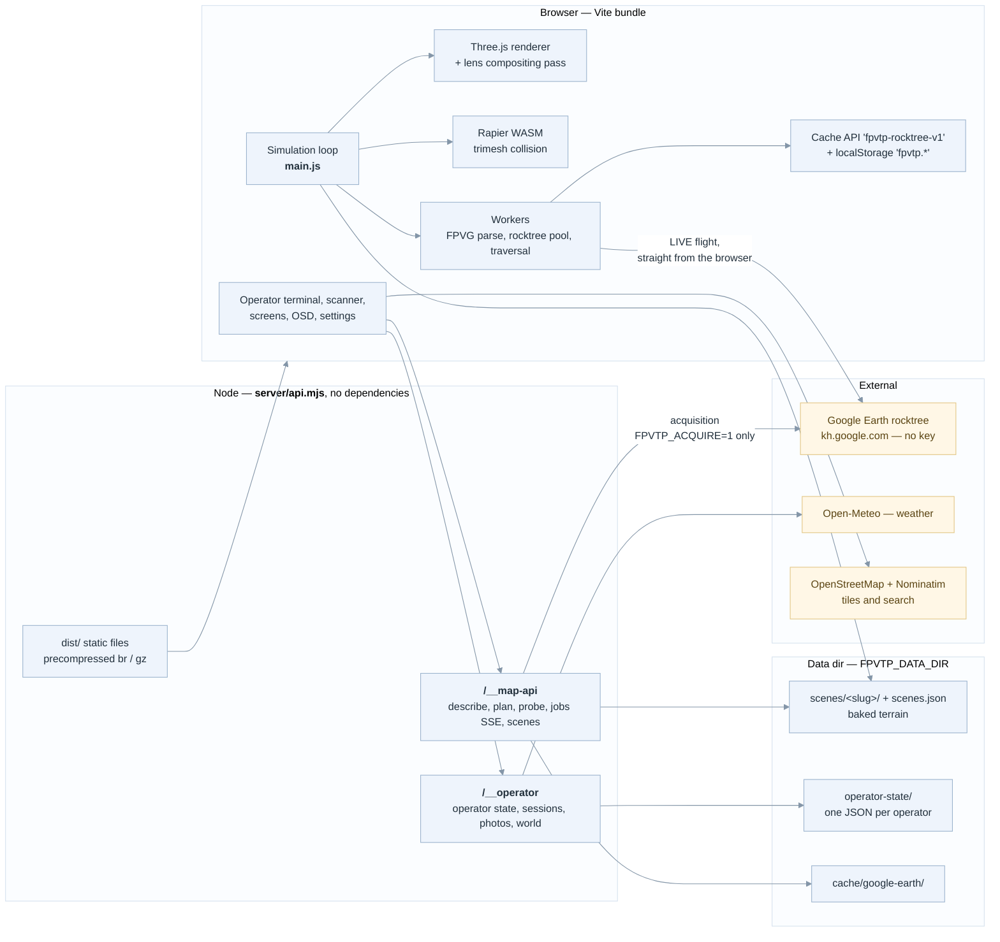
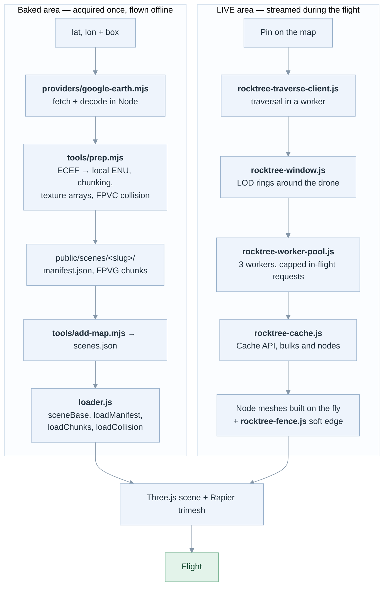
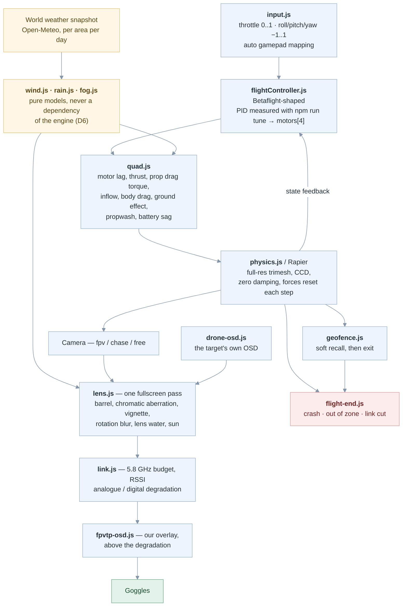

# FPVThePlanet! — how it works, in diagrams

Mermaid views of the running system. They summarise, they do not replace the
sources of truth: `docs/manuel.md` (pipeline), `sim/docs/fpv-rework-architecture.md`
(module-by-module audit and decisions D1-D7), `sim/HANDOFF.md` (verified state).

Rendered as PNG in `sim/docs/diagrams/`, for anywhere Mermaid is not rendered.
**Regenerate them after editing any diagram below** — they went stale once
already, silently, because nothing checks them: between 2026-09-09 and
2026-09-11 the markdown lost the CONTROL VECTOR, gained a guided tour and lost
it again, while the PNGs still showed the first version.

The one-liner writes `out-1.png`, `out-2.png`… in source order, which is why it
is worth spelling out the renaming rather than leaving it to memory. From the
repo root:

```bash
npx @mermaid-js/mermaid-cli -i sim/docs/architecture-diagrams.md -o out.md -e png -s 2
mv out-1.png sim/docs/diagrams/01-player-loop.png
mv out-2.png sim/docs/diagrams/02-runtime-map.png
mv out-3.png sim/docs/diagrams/03-terrain-paths.png
mv out-4.png sim/docs/diagrams/04-flight-stack.png
mv out-5.png sim/docs/diagrams/05-persistence.png
rm out.md
```

`-s 2` renders at twice the size, which is what keeps the text readable when a
tall diagram is scaled to page width. On a headless box Chromium needs a
sandbox flag: add `-p puppeteer.json` with
`{"args": ["--no-sandbox", "--disable-setuid-sandbox"]}`.

`diagrams/simulator.svg` is hand-drawn and is NOT generated — see section 6.

Every diagram opens with the same `%%{init}%%` block: a light palette with dark
text, a 15px base size, and four accent classes that carry meaning rather than
decoration — green for being in the air, red for the flight ending, amber for
anything outside our own code, lavender for browser-local storage. Keep the
block identical across diagrams when editing one, or they stop reading as one
set. The same sources live as Mermaid notes in Trilium; this file stays the one
that is true.

---

## 1. The loop the player goes through

One boot path, traversed with flags — never a parallel pipeline per mode (D7).



> The world persists. The machine doesn't. Terrain is heavy, expensive, kept;
> the drone is free, drawn per target, lost on crash. There is no respawn in
> FIELD — `BENCH` is the exception, where nothing is lost.

---

## 2. Runtime map

`npm run dev` *is* the game (D1). The same routes are served without Vite by
`sim/server/` for the standalone build and the Electron app.



Acquisition — downloading an area, decoding it and writing playable terrain —
is closed by default and never available in `--mode shared`. LIVE flight needs
none of it: tiles go to the player's browser and are never kept.

---

## 3. Where terrain comes from — two paths, one flight



Hard constraints that survive everything: coordinates are local ENU metres,
X east / Y up / Z south; the drone collider is a 0.15 m sphere and `camera.near`
is exactly 0.15; the UV V axis is flipped in `prep.mjs`.

---

## 4. The flight stack, one fixed step

Narrow on purpose — four motor outputs, so a SITL can replace the controller
later. No art-direction module is ever a dependency of the engine (D6).



The order is physical: the lens is glass in front of the sensor, the link is what
happens to the picture afterwards. RF snow is not vignetted, because the vignette
happened two boxes upstream.

Per frame, `main.js` runs a fixed-step accumulator: `controller.update` then
`physics.step` per step, geofence force injected inside the step, and everything
else — telemetry sampling, weather, audio, screens — once per frame.

---

## 5. What is persisted, and where

```mermaid
%%{init: {'theme':'base','themeVariables':{
  'fontFamily':'ui-sans-serif, system-ui, -apple-system, Segoe UI, sans-serif',
  'fontSize':'15px',
  'primaryColor':'#EEF4FC','primaryTextColor':'#22303C','primaryBorderColor':'#9BB3CD',
  'lineColor':'#8496A8','edgeLabelBackground':'#FFFFFF',
  'clusterBkg':'#FBFDFF','clusterBorder':'#D6E2EE',
  'tertiaryColor':'#FFFFFF'}}}%%
flowchart TD
    OPCLIENT["<b>operator.js</b><br/>key in localStorage"] -->|"POST /__operator"| STORE
    SESSION["<b>session.js</b><br/>opens at the first flight frame,<br/>samples telemetry every 0.2 s"] -->|"PATCH session<br/>POST photo"| STORE
    STORE["operator-state/&lt;id&gt;.json<br/><b>tools/operator-store.mjs</b>"]
    STORE --> F1["settings"]
    STORE --> F2["terrainCache<br/>areas kept"]
    STORE --> F3["worldState.weather<br/>7 days per area"]
    STORE --> F4["sessions[]<br/>target, weather, telemetry,<br/>photos, verdict, seq numbers"]
    F4 --> DATASCREEN["DATA screen<br/>replayable archive"]
    LS["localStorage 'fpvtp.*'<br/>gamepad map, audio, lens, mode"] --> BROWSERONLY["Browser-local only"]

    classDef io fill:#F0EBFA,stroke:#B2A4DA,color:#3A2F5E
    class LS,BROWSERONLY io
```



Server-side operator state (D2) is one coherent place next to the terrain, it
survives a browser cache wipe, and it is what makes multi-operator nearly free.

---

## 6. Inside the simulator

Hand-drawn rather than generated: the engine itself, and where each module sits
relative to the fixed step. Edit `diagrams/simulator.svg` directly.


Three things this is meant to make obvious. The controller, the airframe and
Rapier are one loop at a fixed 1/250 s, capped at 12 steps per frame — the rest
of the game runs once per frame around it. The environment models are pure and
sit outside, writing into that loop rather than being part of it. And the image
chain has an order that is physical, not arbitrary: the glass, then the link.

