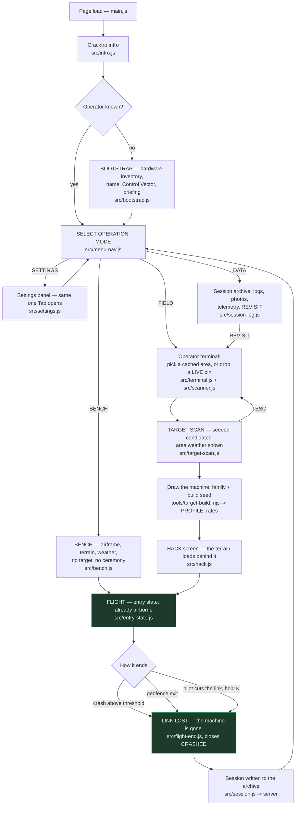
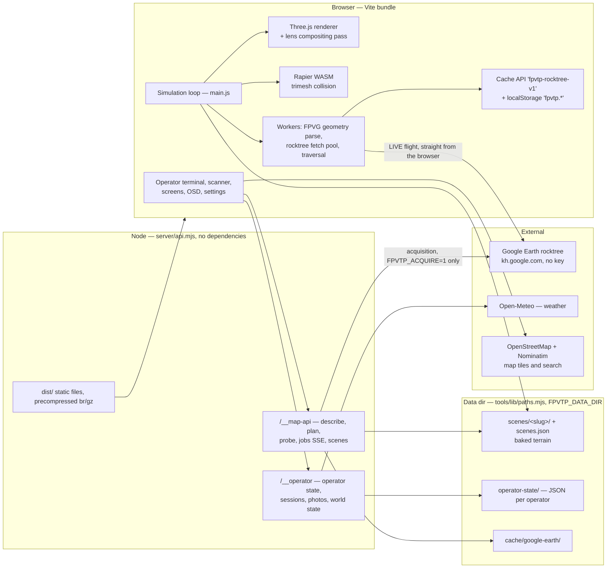
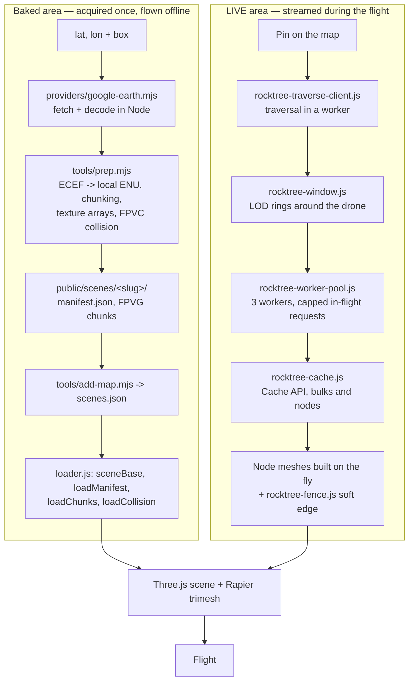
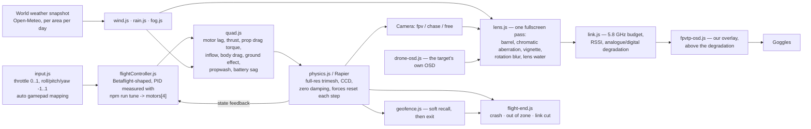
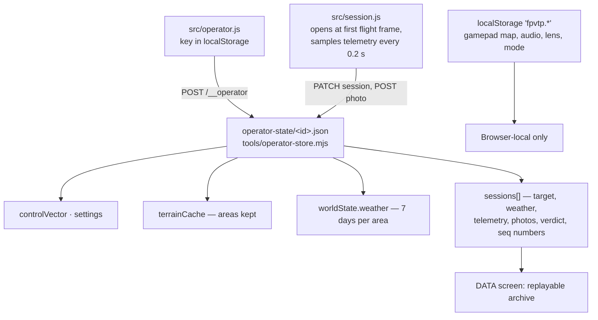

# FPVThePlanet! — how it works, in diagrams

Mermaid views of the running system. They summarise, they do not replace the
sources of truth: `docs/manuel.md` (pipeline), `sim/docs/fpv-rework-architecture.md`
(module-by-module audit and decisions D1-D7), `sim/HANDOFF.md` (verified state).

Rendered as PNG in `sim/docs/diagrams/`, for anywhere Mermaid is not rendered.
Regenerate them after editing a diagram below:

```bash
npx @mermaid-js/mermaid-cli -i sim/docs/architecture-diagrams.md -o out.md -e png
```

---

## 1. The loop the player goes through

One boot path, traversed with flags — never a parallel pipeline per mode (D7).



> The world persists. The machine doesn't. Terrain is heavy, expensive, kept;
> the drone is free, drawn per target, lost on crash. There is no respawn in
> FIELD — `BENCH` is the exception, where nothing is lost.

---

## 2. Runtime map

`npm run dev` *is* the game (D1). The same routes are served without Vite by
`sim/server/` for the standalone build and the Electron app.



Acquisition — downloading an area, decoding it and writing playable terrain —
is closed by default and never available in `--mode shared`. LIVE flight needs
none of it: tiles go to the player's browser and are never kept.

---

## 3. Where terrain comes from — two paths, one flight



Hard constraints that survive everything: coordinates are local ENU metres,
X east / Y up / Z south; the drone collider is a 0.15 m sphere and `camera.near`
is exactly 0.15; the UV V axis is flipped in `prep.mjs`.

---

## 4. The flight stack, one fixed step

Narrow on purpose — four motor outputs, so a SITL can replace the controller
later. No art-direction module is ever a dependency of the engine (D6).



The order is physical: the lens is glass in front of the sensor, the link is what
happens to the picture afterwards. RF snow is not vignetted, because the vignette
happened two boxes upstream.

Per frame, `main.js` runs a fixed-step accumulator: `controller.update` then
`physics.step` per step, geofence force injected inside the step, and everything
else — telemetry sampling, weather, audio, screens — once per frame.

---

## 5. What is persisted, and where



Server-side operator state (D2) is one coherent place next to the terrain, it
survives a browser cache wipe, and it is what makes multi-operator nearly free.
