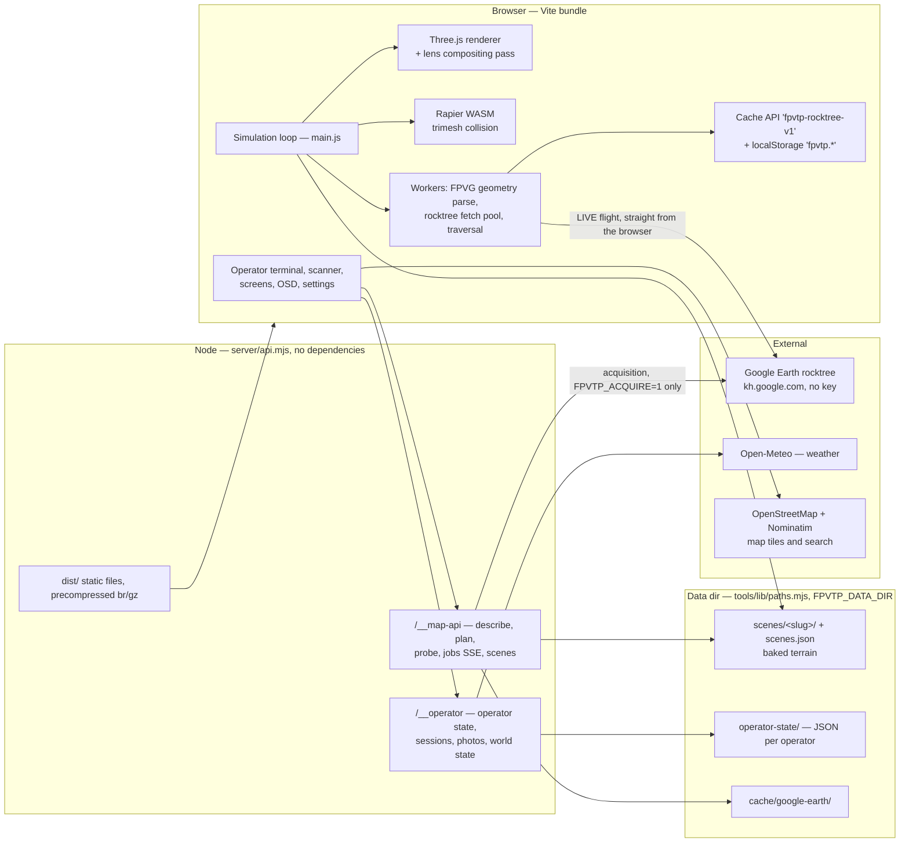
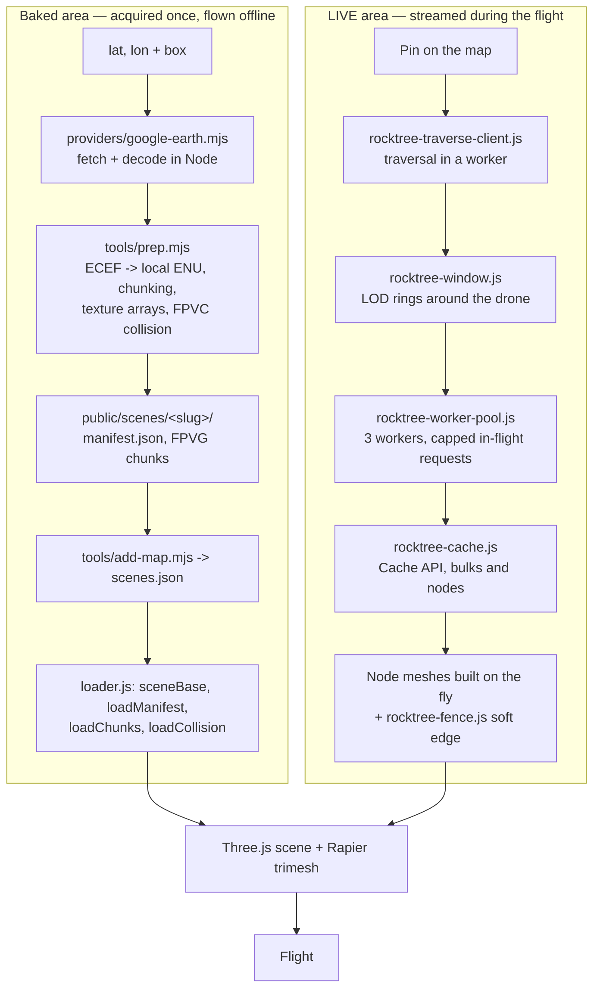
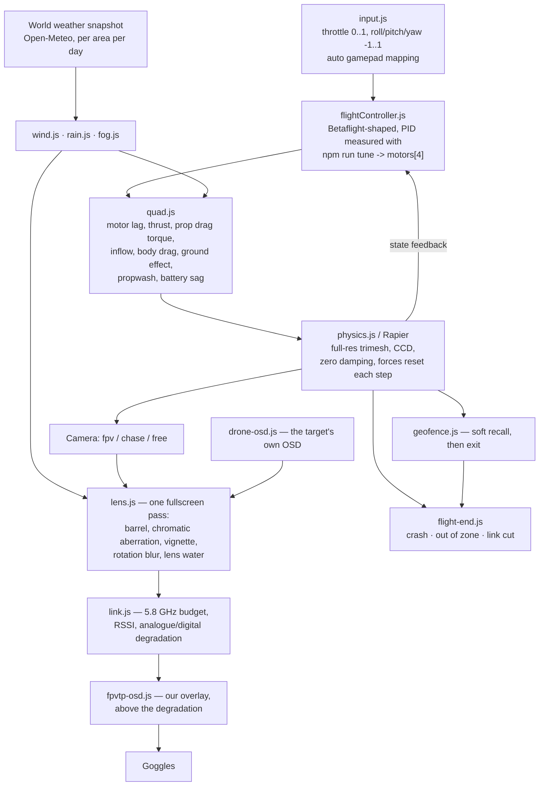
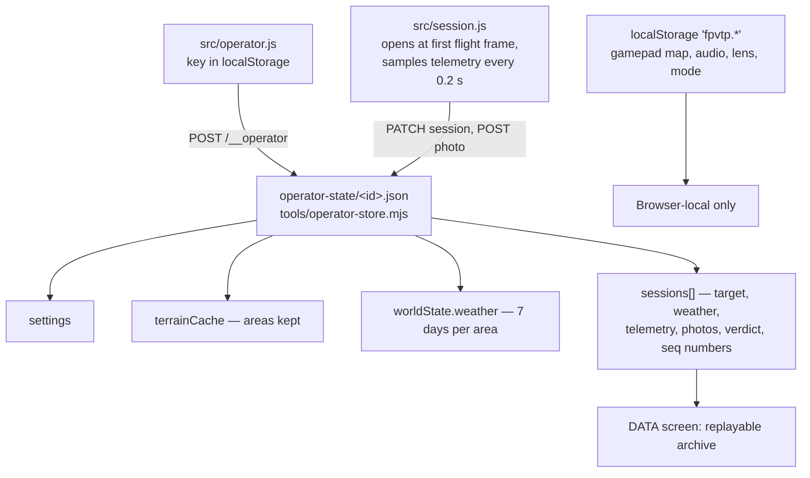

# FPVThePlanet! — how it works, in diagrams

Mermaid views of the running system. They summarise, they do not replace the
sources of truth: `docs/manuel.md` (pipeline), `sim/docs/fpv-rework-architecture.md`
(module-by-module audit and decisions D1-D7), `sim/HANDOFF.md` (verified state).

Rendered as PNG in `sim/docs/diagrams/`, for anywhere Mermaid is not rendered.
**Regenerate them after editing any diagram below** — they went stale once
already, silently, because nothing checks them: between 2026-09-09 and
2026-09-11 the markdown lost the CONTROL VECTOR, gained a guided tour and lost
it again, while the PNGs still showed the first version.

The one-liner writes `out-1.png`, `out-2.png`… in source order, which is why it
is worth spelling out the renaming rather than leaving it to memory. From the
repo root:

```bash
npx @mermaid-js/mermaid-cli -i sim/docs/architecture-diagrams.md -o out.md -e png -s 2
mv out-1.png sim/docs/diagrams/01-player-loop.png
mv out-2.png sim/docs/diagrams/02-runtime-map.png
mv out-3.png sim/docs/diagrams/03-terrain-paths.png
mv out-4.png sim/docs/diagrams/04-flight-stack.png
mv out-5.png sim/docs/diagrams/05-persistence.png
rm out.md
```

`-s 2` renders at twice the size, which is what keeps the text readable when a
tall diagram is scaled to page width. On a headless box Chromium needs a
sandbox flag: add `-p puppeteer.json` with
`{"args": ["--no-sandbox", "--disable-setuid-sandbox"]}`.

`diagrams/simulator.svg` is hand-drawn and is NOT generated — see section 6.

---

## 1. The loop the player goes through

One boot path, traversed with flags — never a parallel pipeline per mode (D7).


> The world persists. The machine doesn't. Terrain is heavy, expensive, kept;
> the drone is free, drawn per target, lost on crash. There is no respawn in
> FIELD — `BENCH` is the exception, where nothing is lost.

---
<svg id="mermaid-graph-5" width="930.8046875" xmlns="http://www.w3.org/2000/svg" class="flowchart" height="2250.815185546875" viewBox="0 -0.000003814697265625 930.8046875 2250.815185546875" role="graphics-document document" aria-roledescription="flowchart-v2"><style>#mermaid-graph-5{font-size:15px;fill:#22303C;}@keyframes edge-animation-frame{from{stroke-dashoffset:0;}}@keyframes dash{to{stroke-dashoffset:0;}}#mermaid-graph-5 .edge-animation-slow{stroke-dasharray:9,5!important;stroke-dashoffset:900;animation:dash 50s linear infinite;stroke-linecap:round;}#mermaid-graph-5 .edge-animation-fast{stroke-dasharray:9,5!important;stroke-dashoffset:900;animation:dash 20s linear infinite;stroke-linecap:round;}#mermaid-graph-5 .error-icon{fill:#FFFFFF;}#mermaid-graph-5 .error-text{fill:#000000;stroke:#000000;}#mermaid-graph-5 .edge-thickness-normal{stroke-width:1px;}#mermaid-graph-5 .edge-thickness-thick{stroke-width:3.5px;}#mermaid-graph-5 .edge-pattern-solid{stroke-dasharray:0;}#mermaid-graph-5 .edge-thickness-invisible{stroke-width:0;fill:none;}#mermaid-graph-5 .edge-pattern-dashed{stroke-dasharray:3;}#mermaid-graph-5 .edge-pattern-dotted{stroke-dasharray:2;}#mermaid-graph-5 .marker{fill:#8496A8;stroke:#8496A8;}#mermaid-graph-5 .marker.cross{stroke:#8496A8;}#mermaid-graph-5 svg{font-size:15px;}#mermaid-graph-5 p{margin:0;}#mermaid-graph-5 .label{color:#22303C;}#mermaid-graph-5 .cluster-label text{fill:#000000;}#mermaid-graph-5 .cluster-label span{color:#000000;}#mermaid-graph-5 .cluster-label span p{background-color:transparent;}#mermaid-graph-5 .label text,#mermaid-graph-5 span{fill:#22303C;color:#22303C;}#mermaid-graph-5 .node rect,#mermaid-graph-5 .node circle,#mermaid-graph-5 .node ellipse,#mermaid-graph-5 .node polygon,#mermaid-graph-5 .node path{fill:#EEF4FC;stroke:#9BB3CD;stroke-width:1px;}#mermaid-graph-5 .rough-node .label text,#mermaid-graph-5 .node .label text,#mermaid-graph-5 .image-shape .label,#mermaid-graph-5 .icon-shape .label{text-anchor:middle;}#mermaid-graph-5 .node .katex path{fill:#000;stroke:#000;stroke-width:1px;}#mermaid-graph-5 .rough-node .label,#mermaid-graph-5 .node .label,#mermaid-graph-5 .image-shape .label,#mermaid-graph-5 .icon-shape .label{text-align:center;}#mermaid-graph-5 .node.clickable{cursor:pointer;}#mermaid-graph-5 .root .anchor path{fill:#8496A8!important;stroke-width:0;stroke:#8496A8;}#mermaid-graph-5 .arrowheadPath{fill:#0b0b0b;}#mermaid-graph-5 .edgePath .path{stroke:#8496A8;stroke-width:1px;}#mermaid-graph-5 .flowchart-link{stroke:#8496A8;fill:none;}#mermaid-graph-5 .edgeLabel{background-color:#FFFFFF;text-align:center;}#mermaid-graph-5 .edgeLabel p{background-color:#FFFFFF;}#mermaid-graph-5 .edgeLabel rect{opacity:0.5;background-color:#FFFFFF;fill:#FFFFFF;}#mermaid-graph-5 .labelBkg{background-color:rgba(255, 255, 255, 0.5);}#mermaid-graph-5 .cluster rect{fill:#FBFDFF;stroke:#D6E2EE;stroke-width:1px;}#mermaid-graph-5 .cluster text{fill:#000000;}#mermaid-graph-5 .cluster span{color:#000000;}#mermaid-graph-5 div.mermaidTooltip{position:absolute;text-align:center;max-width:200px;padding:2px;font-size:12px;background:#FFFFFF;border:1px solid hsl(0, 0%, 90%);border-radius:2px;pointer-events:none;z-index:100;}#mermaid-graph-5 .flowchartTitleText{text-anchor:middle;font-size:18px;fill:#22303C;}#mermaid-graph-5 rect.text{fill:none;stroke-width:0;}#mermaid-graph-5 .icon-shape,#mermaid-graph-5 .image-shape{background-color:#FFFFFF;text-align:center;}#mermaid-graph-5 .icon-shape p,#mermaid-graph-5 .image-shape p{background-color:#FFFFFF;padding:2px;}#mermaid-graph-5 .icon-shape .label rect,#mermaid-graph-5 .image-shape .label rect{opacity:0.5;background-color:#FFFFFF;fill:#FFFFFF;}#mermaid-graph-5 .label-icon{display:inline-block;height:1em;overflow:visible;vertical-align:-0.125em;}#mermaid-graph-5 .node .label-icon path{fill:currentColor;stroke:revert;stroke-width:revert;}#mermaid-graph-5 .node .neo-node{stroke:#9BB3CD;}#mermaid-graph-5 [data-look="neo"].node rect,#mermaid-graph-5 [data-look="neo"].cluster rect,#mermaid-graph-5 [data-look="neo"].node polygon{stroke:url(#mermaid-graph-5-gradient);filter:drop-shadow( 1px 2px 2px rgba(185,185,185,1));}#mermaid-graph-5 [data-look="neo"].swimlane.cluster rect{filter:none;}#mermaid-graph-5 [data-look="neo"].node path{stroke:url(#mermaid-graph-5-gradient);stroke-width:1px;}#mermaid-graph-5 [data-look="neo"].node .outer-path{filter:drop-shadow( 1px 2px 2px rgba(185,185,185,1));}#mermaid-graph-5 [data-look="neo"].node .neo-line path{stroke:#9BB3CD;filter:none;}#mermaid-graph-5 [data-look="neo"].node circle{stroke:url(#mermaid-graph-5-gradient);filter:drop-shadow( 1px 2px 2px rgba(185,185,185,1));}#mermaid-graph-5 [data-look="neo"].node circle .state-start{fill:#000000;}#mermaid-graph-5 [data-look="neo"].icon-shape .icon{fill:url(#mermaid-graph-5-gradient);filter:drop-shadow( 1px 2px 2px rgba(185,185,185,1));}#mermaid-graph-5 [data-look="neo"].icon-shape .icon-neo path{stroke:url(#mermaid-graph-5-gradient);filter:drop-shadow( 1px 2px 2px rgba(185,185,185,1));}#mermaid-graph-5 :root{--mermaid-font-family:"trebuchet ms",verdana,arial,sans-serif;}#mermaid-graph-5 .flight&gt;*{fill:rgb(227, 243, 234)!important;stroke:rgb(111, 174, 139)!important;color:rgb(22, 74, 48)!important;}#mermaid-graph-5 .flight span{fill:rgb(227, 243, 234)!important;stroke:rgb(111, 174, 139)!important;color:rgb(22, 74, 48)!important;}#mermaid-graph-5 .flight tspan{fill:rgb(22, 74, 48)!important;}#mermaid-graph-5 .stop&gt;*{fill:rgb(251, 235, 235)!important;stroke:rgb(217, 160, 160)!important;color:rgb(110, 34, 34)!important;}#mermaid-graph-5 .stop span{fill:rgb(251, 235, 235)!important;stroke:rgb(217, 160, 160)!important;color:rgb(110, 34, 34)!important;}#mermaid-graph-5 .stop tspan{fill:rgb(110, 34, 34)!important;}</style><g><marker id="mermaid-graph-5_flowchart-v2-pointEnd" class="marker flowchart-v2" viewBox="0 0 10 10" refX="5" refY="5" markerUnits="userSpaceOnUse" markerWidth="8" markerHeight="8" orient="auto"><path d="M 0 0 L 10 5 L 0 10 z" class="arrowMarkerPath" style="stroke-width: 1; stroke-dasharray: 1, 0;"></path></marker><marker id="mermaid-graph-5_flowchart-v2-pointStart" class="marker flowchart-v2" viewBox="0 0 10 10" refX="4.5" refY="5" markerUnits="userSpaceOnUse" markerWidth="8" markerHeight="8" orient="auto"><path d="M 0 5 L 10 10 L 10 0 z" class="arrowMarkerPath" style="stroke-width: 1; stroke-dasharray: 1, 0;"></path></marker><marker id="mermaid-graph-5_flowchart-v2-pointEnd-margin" class="marker flowchart-v2" viewBox="0 0 11.5 14" refX="11.5" refY="7" markerUnits="userSpaceOnUse" markerWidth="10.5" markerHeight="14" orient="auto"><path d="M 0 0 L 11.5 7 L 0 14 z" class="arrowMarkerPath" style="stroke-width: 0; stroke-dasharray: 1, 0;"></path></marker><marker id="mermaid-graph-5_flowchart-v2-pointStart-margin" class="marker flowchart-v2" viewBox="0 0 11.5 14" refX="1" refY="7" markerUnits="userSpaceOnUse" markerWidth="11.5" markerHeight="14" orient="auto"><polygon points="0,7 11.5,14 11.5,0" class="arrowMarkerPath" style="stroke-width: 0; stroke-dasharray: 1, 0;"></polygon></marker><marker id="mermaid-graph-5_flowchart-v2-circleEnd" class="marker flowchart-v2" viewBox="0 0 10 10" refX="11" refY="5" markerUnits="userSpaceOnUse" markerWidth="11" markerHeight="11" orient="auto"><circle cx="5" cy="5" r="5" class="arrowMarkerPath" style="stroke-width: 1; stroke-dasharray: 1, 0;"></circle></marker><marker id="mermaid-graph-5_flowchart-v2-circleStart" class="marker flowchart-v2" viewBox="0 0 10 10" refX="-1" refY="5" markerUnits="userSpaceOnUse" markerWidth="11" markerHeight="11" orient="auto"><circle cx="5" cy="5" r="5" class="arrowMarkerPath" style="stroke-width: 1; stroke-dasharray: 1, 0;"></circle></marker><marker id="mermaid-graph-5_flowchart-v2-circleEnd-margin" class="marker flowchart-v2" viewBox="0 0 10 10" refY="5" refX="12.25" markerUnits="userSpaceOnUse" markerWidth="14" markerHeight="14" orient="auto"><circle cx="5" cy="5" r="5" class="arrowMarkerPath" style="stroke-width: 0; stroke-dasharray: 1, 0;"></circle></marker><marker id="mermaid-graph-5_flowchart-v2-circleStart-margin" class="marker flowchart-v2" viewBox="0 0 10 10" refX="-2" refY="5" markerUnits="userSpaceOnUse" markerWidth="14" markerHeight="14" orient="auto"><circle cx="5" cy="5" r="5" class="arrowMarkerPath" style="stroke-width: 0; stroke-dasharray: 1, 0;"></circle></marker><marker id="mermaid-graph-5_flowchart-v2-crossEnd" class="marker cross flowchart-v2" viewBox="0 0 11 11" refX="12" refY="5.2" markerUnits="userSpaceOnUse" markerWidth="11" markerHeight="11" orient="auto"><path d="M 1,1 l 9,9 M 10,1 l -9,9" class="arrowMarkerPath" style="stroke-width: 2; stroke-dasharray: 1, 0;"></path></marker><marker id="mermaid-graph-5_flowchart-v2-crossStart" class="marker cross flowchart-v2" viewBox="0 0 11 11" refX="-1" refY="5.2" markerUnits="userSpaceOnUse" markerWidth="11" markerHeight="11" orient="auto"><path d="M 1,1 l 9,9 M 10,1 l -9,9" class="arrowMarkerPath" style="stroke-width: 2; stroke-dasharray: 1, 0;"></path></marker><marker id="mermaid-graph-5_flowchart-v2-crossEnd-margin" class="marker cross flowchart-v2" viewBox="0 0 15 15" refX="17.7" refY="7.5" markerUnits="userSpaceOnUse" markerWidth="12" markerHeight="12" orient="auto"><path d="M 1,1 L 14,14 M 1,14 L 14,1" class="arrowMarkerPath" style="stroke-width: 2.5;"></path></marker><marker id="mermaid-graph-5_flowchart-v2-crossStart-margin" class="marker cross flowchart-v2" viewBox="0 0 15 15" refX="-3.5" refY="7.5" markerUnits="userSpaceOnUse" markerWidth="12" markerHeight="12" orient="auto"><path d="M 1,1 L 14,14 M 1,14 L 14,1" class="arrowMarkerPath" style="stroke-width: 2.5; stroke-dasharray: 1, 0;"></path></marker><g class="root"><g class="clusters"></g><g class="edgePaths"><path d="M328.501,83L328.501,87.167C328.501,91.333,328.501,99.667,328.501,107.333C328.501,115,328.501,122,328.501,125.5L328.501,129" id="mermaid-graph-5-L_LOAD_INTRO_0" class="edge-thickness-normal edge-pattern-solid edge-thickness-normal edge-pattern-solid flowchart-link" style=";" data-edge="true" data-et="edge" data-id="L_LOAD_INTRO_0" data-points="W3sieCI6MzI4LjUwMDcwNzYyNjM0MjgsInkiOjgzfSx7IngiOjMyOC41MDA3MDc2MjYzNDI4LCJ5IjoxMDh9LHsieCI6MzI4LjUwMDcwNzYyNjM0MjgsInkiOjEzM31d" data-look="classic" marker-end="url(#mermaid-graph-5_flowchart-v2-pointEnd)"></path><path d="M328.501,208L328.501,212.167C328.501,216.333,328.501,224.667,328.501,232.333C328.501,240,328.501,247,328.501,250.5L328.501,254" id="mermaid-graph-5-L_INTRO_OP_0" class="edge-thickness-normal edge-pattern-solid edge-thickness-normal edge-pattern-solid flowchart-link" style=";" data-edge="true" data-et="edge" data-id="L_INTRO_OP_0" data-points="W3sieCI6MzI4LjUwMDcwNzYyNjM0MjgsInkiOjIwOH0seyJ4IjozMjguNTAwNzA3NjI2MzQyOCwieSI6MjMzfSx7IngiOjMyOC41MDA3MDc2MjYzNDI4LCJ5IjoyNTh9XQ==" data-look="classic" marker-end="url(#mermaid-graph-5_flowchart-v2-pointEnd)"></path><path d="M359.992,364.108L369.522,375.398C379.052,386.688,398.112,409.269,407.643,425.934C417.173,442.599,417.173,453.349,417.173,458.724L417.173,464.099" id="mermaid-graph-5-L_OP_BOOT_0" class="edge-thickness-normal edge-pattern-solid edge-thickness-normal edge-pattern-solid flowchart-link" style=";" data-edge="true" data-et="edge" data-id="L_OP_BOOT_0" data-points="W3sieCI6MzU5Ljk5MjI5MTA5ODU4NzYsInkiOjM2NC4xMDc4NDI3OTcyODY1fSx7IngiOjQxNy4xNzI1ODI2MjYzNDI4LCJ5Ijo0MzEuODQ5NDI2MjY5NTMxMjV9LHsieCI6NDE3LjE3MjU4MjYyNjM0MjgsInkiOjQ2OC4wOTk0MjYyNjk1MzEyNX1d" data-look="classic" marker-end="url(#mermaid-graph-5_flowchart-v2-pointEnd)"></path><path d="M297.009,364.108L287.479,375.398C277.949,386.688,258.889,409.269,249.359,436.601C239.829,463.933,239.829,496.016,239.829,526.224C239.829,556.433,239.829,584.766,245.195,602.715C250.562,620.665,261.295,628.23,266.662,632.012L272.028,635.795" id="mermaid-graph-5-L_OP_MODE_0" class="edge-thickness-normal edge-pattern-solid edge-thickness-normal edge-pattern-solid flowchart-link" style=";" data-edge="true" data-et="edge" data-id="L_OP_MODE_0" data-points="W3sieCI6Mjk3LjAwOTEyNDE1NDA5OCwieSI6MzY0LjEwNzg0Mjc5NzI4NjV9LHsieCI6MjM5LjgyODgzMjYyNjM0Mjc3LCJ5Ijo0MzEuODQ5NDI2MjY5NTMxMjV9LHsieCI6MjM5LjgyODgzMjYyNjM0Mjc3LCJ5Ijo1MjguMDk5NDI2MjY5NTMxMn0seyJ4IjoyMzkuODI4ODMyNjI2MzQyNzcsInkiOjYxMy4wOTk0MjYyNjk1MzEyfSx7IngiOjI3NS4yOTc1ODI2MjYzNDI4LCJ5Ijo2MzguMDk5NDI2MjY5NTMxMn1d" data-look="classic" marker-end="url(#mermaid-graph-5_flowchart-v2-pointEnd)"></path><path d="M417.173,588.099L417.173,592.266C417.173,596.433,417.173,604.766,411.806,612.715C406.439,620.665,395.706,628.23,390.34,632.012L384.973,635.795" id="mermaid-graph-5-L_BOOT_MODE_0" class="edge-thickness-normal edge-pattern-solid edge-thickness-normal edge-pattern-solid flowchart-link" style=";" data-edge="true" data-et="edge" data-id="L_BOOT_MODE_0" data-points="W3sieCI6NDE3LjE3MjU4MjYyNjM0MjgsInkiOjU4OC4wOTk0MjYyNjk1MzEyfSx7IngiOjQxNy4xNzI1ODI2MjYzNDI4LCJ5Ijo2MTMuMDk5NDI2MjY5NTMxMn0seyJ4IjozODEuNzAzODMyNjI2MzQyOCwieSI6NjM4LjA5OTQyNjI2OTUzMTJ9XQ==" data-look="classic" marker-end="url(#mermaid-graph-5_flowchart-v2-pointEnd)"></path><path d="M231.636,713.099L216.03,719.141C200.424,725.183,169.212,737.266,153.606,750.558C138,763.849,138,778.349,138,785.599L138,792.849" id="mermaid-graph-5-L_MODE_SET_0" class="edge-thickness-normal edge-pattern-solid edge-thickness-normal edge-pattern-solid flowchart-link" style=";" data-edge="true" data-et="edge" data-id="L_MODE_SET_0" data-points="W3sieCI6MjMxLjYzNTk0MTAzNjY3Njk3LCJ5Ijo3MTMuMDk5NDI2MjY5NTMxMn0seyJ4IjoxMzgsInkiOjc0OS4zNDk0MjYyNjk1MzEyfSx7IngiOjEzOCwieSI6Nzk2Ljg0OTQyNjI2OTUzMTJ9XQ==" data-look="classic" marker-end="url(#mermaid-graph-5_flowchart-v2-pointEnd)"></path><path d="M189.151,796.849L197.458,788.933C205.764,781.016,222.378,765.183,237.502,751.648C252.627,738.114,266.264,726.878,273.082,721.261L279.9,715.643" id="mermaid-graph-5-L_SET_MODE_0" class="edge-thickness-normal edge-pattern-solid edge-thickness-normal edge-pattern-solid flowchart-link" style=";" data-edge="true" data-et="edge" data-id="L_SET_MODE_0" data-points="W3sieCI6MTg5LjE1MTE2NzQ2MDg1MDMsInkiOjc5Ni44NDk0MjYyNjk1MzEyfSx7IngiOjIzOC45OTA3NjY1MjUyNjg1NSwieSI6NzQ5LjM0OTQyNjI2OTUzMTJ9LHsieCI6MjgyLjk4NzE3ODI1MjkxNTIsInkiOjcxMy4wOTk0MjYyNjk1MzEyfV0=" data-look="classic" marker-end="url(#mermaid-graph-5_flowchart-v2-pointEnd)"></path><path d="M455.944,699.38L500.575,707.708C545.206,716.037,634.469,732.693,679.1,746.396C723.732,760.099,723.732,770.849,723.732,776.224L723.732,781.599" id="mermaid-graph-5-L_MODE_DATA_0" class="edge-thickness-normal edge-pattern-solid edge-thickness-normal edge-pattern-solid flowchart-link" style=";" data-edge="true" data-et="edge" data-id="L_MODE_DATA_0" data-points="W3sieCI6NDU1Ljk0Mzg4Mzg5NTg3NCwieSI6Njk5LjM4MDMwMDA4MTM0ODd9LHsieCI6NzIzLjczMTUyNzMyODQ5MTIsInkiOjc0OS4zNDk0MjYyNjk1MzEyfSx7IngiOjcyMy43MzE1MjczMjg0OTEyLCJ5Ijo3ODUuNTk5NDI2MjY5NTMxMn1d" data-look="classic" marker-end="url(#mermaid-graph-5_flowchart-v2-pointEnd)"></path><path d="M315.534,713.099L313.445,719.141C311.356,725.183,307.178,737.266,305.089,759.349C303,781.433,303,813.516,303,845.599C303,877.683,303,909.766,303,939.974C303,970.183,303,998.516,303,1026.849C303,1055.183,303,1083.516,303,1113.724C303,1143.933,303,1176.016,303,1206.224C303,1236.433,303,1264.766,303,1291.224C303,1317.683,303,1342.266,303,1366.849C303,1391.433,303,1416.016,303,1431.808C303,1447.599,303,1454.599,303,1458.099L303,1461.599" id="mermaid-graph-5-L_MODE_BENCH_0" class="edge-thickness-normal edge-pattern-solid edge-thickness-normal edge-pattern-solid flowchart-link" style=";" data-edge="true" data-et="edge" data-id="L_MODE_BENCH_0" data-points="W3sieCI6MzE1LjUzNDI0NjEyMTQyMjcsInkiOjcxMy4wOTk0MjYyNjk1MzEyfSx7IngiOjMwMywieSI6NzQ5LjM0OTQyNjI2OTUzMTJ9LHsieCI6MzAzLCJ5Ijo4NDUuNTk5NDI2MjY5NTMxMn0seyJ4IjozMDMsInkiOjk0MS44NDk0MjYyNjk1MzEyfSx7IngiOjMwMywieSI6MTAyNi44NDk0MjYyNjk1MzEyfSx7IngiOjMwMywieSI6MTExMS44NDk0MjYyNjk1MzEyfSx7IngiOjMwMywieSI6MTIwOC4wOTk0MjYyNjk1MzEyfSx7IngiOjMwMywieSI6MTI5My4wOTk0MjYyNjk1MzEyfSx7IngiOjMwMywieSI6MTM2Ni44NDk0MjYyNjk1MzEyfSx7IngiOjMwMywieSI6MTQ0MC41OTk0MjYyNjk1MzEyfSx7IngiOjMwMywieSI6MTQ2NS41OTk0MjYyNjk1MzEyfV0=" data-look="classic" marker-end="url(#mermaid-graph-5_flowchart-v2-pointEnd)"></path><path d="M416.465,713.099L430.637,719.141C444.81,725.183,473.154,737.266,487.326,759.349C501.498,781.433,501.498,813.516,501.498,845.599C501.498,877.683,501.498,909.766,508.165,931.42C514.831,953.074,528.165,964.299,534.832,969.911L541.498,975.523" id="mermaid-graph-5-L_MODE_TERM_0" class="edge-thickness-normal edge-pattern-solid edge-thickness-normal edge-pattern-solid flowchart-link" style=";" data-edge="true" data-et="edge" data-id="L_MODE_TERM_0" data-points="W3sieCI6NDE2LjQ2NTM2NDI2MjIwOTEsInkiOjcxMy4wOTk0MjYyNjk1MzEyfSx7IngiOjUwMS40OTc4NjU2NzY4Nzk5LCJ5Ijo3NDkuMzQ5NDI2MjY5NTMxMn0seyJ4Ijo1MDEuNDk3ODY1Njc2ODc5OSwieSI6ODQ1LjU5OTQyNjI2OTUzMTJ9LHsieCI6NTAxLjQ5Nzg2NTY3Njg3OTksInkiOjk0MS44NDk0MjYyNjk1MzEyfSx7IngiOjU0NC41NTgzNjk2NjQ1ODQ5LCJ5Ijo5NzguMDk5NDI2MjY5NTMxMn1d" data-look="classic" marker-end="url(#mermaid-graph-5_flowchart-v2-pointEnd)"></path><path d="M723.732,905.599L723.732,911.641C723.732,917.683,723.732,929.766,715.658,941.467C707.585,953.167,691.438,964.485,683.365,970.144L675.291,975.803" id="mermaid-graph-5-L_DATA_TERM_0" class="edge-thickness-normal edge-pattern-solid edge-thickness-normal edge-pattern-solid flowchart-link" style=";" data-edge="true" data-et="edge" data-id="L_DATA_TERM_0" data-points="W3sieCI6NzIzLjczMTUyNzMyODQ5MTIsInkiOjkwNS41OTk0MjYyNjk1MzEyfSx7IngiOjcyMy43MzE1MjczMjg0OTEyLCJ5Ijo5NDEuODQ5NDI2MjY5NTMxMn0seyJ4Ijo2NzIuMDE1OTEwOTA1OTUwMiwieSI6OTc4LjA5OTQyNjI2OTUzMTJ9XQ==" data-look="classic" marker-end="url(#mermaid-graph-5_flowchart-v2-pointEnd)"></path><path d="M546.143,1075.599L539.163,1081.641C532.182,1087.683,518.221,1099.766,516.929,1111.383C515.637,1122.999,527.014,1134.15,532.702,1139.725L538.391,1145.3" id="mermaid-graph-5-L_TERM_SCAN_0" class="edge-thickness-normal edge-pattern-solid edge-thickness-normal edge-pattern-solid flowchart-link" style=";" data-edge="true" data-et="edge" data-id="L_TERM_SCAN_0" data-points="W3sieCI6NTQ2LjE0MjkwNzU0OTM1MzMsInkiOjEwNzUuNTk5NDI2MjY5NTMxMn0seyJ4Ijo1MDQuMjYwNjQ5NjgxMDkxMywieSI6MTExMS44NDk0MjYyNjk1MzEyfSx7IngiOjU0MS4yNDc1Nzg3MDc2MDgzLCJ5IjoxMTQ4LjA5OTQyNjI2OTUzMTJ9XQ==" data-look="classic" marker-end="url(#mermaid-graph-5_flowchart-v2-pointEnd)"></path><path d="M718.649,1148.099L730.348,1142.058C742.046,1136.016,765.444,1123.933,764.502,1112.126C763.56,1100.319,738.279,1088.789,725.638,1083.024L712.998,1077.259" id="mermaid-graph-5-L_SCAN_TERM_0" class="edge-thickness-normal edge-pattern-solid edge-thickness-normal edge-pattern-solid flowchart-link" style=";" data-edge="true" data-et="edge" data-id="L_SCAN_TERM_0" data-points="W3sieCI6NzE4LjY0ODY5ODU4MzgyNTksInkiOjExNDguMDk5NDI2MjY5NTMxMn0seyJ4Ijo3ODguODQxNjEyODE1ODU2OSwieSI6MTExMS44NDk0MjYyNjk1MzEyfSx7IngiOjcwOS4zNTg0NTk5MzU0Njg4LCJ5IjoxMDc1LjU5OTQyNjI2OTUzMTJ9XQ==" data-look="classic" marker-end="url(#mermaid-graph-5_flowchart-v2-pointEnd)"></path><path d="M602.467,1268.099L602.467,1272.266C602.467,1276.433,602.467,1284.766,602.467,1292.433C602.467,1300.099,602.467,1307.099,602.467,1310.599L602.467,1314.099" id="mermaid-graph-5-L_SCAN_BUILD_0" class="edge-thickness-normal edge-pattern-solid edge-thickness-normal edge-pattern-solid flowchart-link" style=";" data-edge="true" data-et="edge" data-id="L_SCAN_BUILD_0" data-points="W3sieCI6NjAyLjQ2NzMyMzMwMzIyMjcsInkiOjEyNjguMDk5NDI2MjY5NTMxMn0seyJ4Ijo2MDIuNDY3MzIzMzAzMjIyNywieSI6MTI5My4wOTk0MjYyNjk1MzEyfSx7IngiOjYwMi40NjczMjMzMDMyMjI3LCJ5IjoxMzE4LjA5OTQyNjI2OTUzMTJ9XQ==" data-look="classic" marker-end="url(#mermaid-graph-5_flowchart-v2-pointEnd)"></path><path d="M602.467,1415.599L602.467,1419.766C602.467,1423.933,602.467,1432.266,602.467,1441.808C602.467,1451.349,602.467,1462.099,602.467,1467.474L602.467,1472.849" id="mermaid-graph-5-L_BUILD_HACK_0" class="edge-thickness-normal edge-pattern-solid edge-thickness-normal edge-pattern-solid flowchart-link" style=";" data-edge="true" data-et="edge" data-id="L_BUILD_HACK_0" data-points="W3sieCI6NjAyLjQ2NzMyMzMwMzIyMjcsInkiOjE0MTUuNTk5NDI2MjY5NTMxMn0seyJ4Ijo2MDIuNDY3MzIzMzAzMjIyNywieSI6MTQ0MC41OTk0MjYyNjk1MzEyfSx7IngiOjYwMi40NjczMjMzMDMyMjI3LCJ5IjoxNDc2Ljg0OTQyNjI2OTUzMTJ9XQ==" data-look="classic" marker-end="url(#mermaid-graph-5_flowchart-v2-pointEnd)"></path><path d="M303,1585.599L303,1589.766C303,1593.933,303,1602.266,309.116,1610.247C315.233,1618.227,327.466,1625.855,333.582,1629.669L339.699,1633.483" id="mermaid-graph-5-L_BENCH_FLIGHT_0" class="edge-thickness-normal edge-pattern-solid edge-thickness-normal edge-pattern-solid flowchart-link" style=";" data-edge="true" data-et="edge" data-id="L_BENCH_FLIGHT_0" data-points="W3sieCI6MzAzLCJ5IjoxNTg1LjU5OTQyNjI2OTUzMTJ9LHsieCI6MzAzLCJ5IjoxNjEwLjU5OTQyNjI2OTUzMTJ9LHsieCI6MzQzLjA5MjkzMDU1MTMwMjYzLCJ5IjoxNjM1LjU5OTQyNjI2OTUzMTJ9XQ==" data-look="classic" marker-end="url(#mermaid-graph-5_flowchart-v2-pointEnd)"></path><path d="M602.467,1574.349L602.467,1580.391C602.467,1586.433,602.467,1598.516,592.848,1608.473C583.228,1618.43,563.99,1626.261,554.37,1630.176L544.751,1634.091" id="mermaid-graph-5-L_HACK_FLIGHT_0" class="edge-thickness-normal edge-pattern-solid edge-thickness-normal edge-pattern-solid flowchart-link" style=";" data-edge="true" data-et="edge" data-id="L_HACK_FLIGHT_0" data-points="W3sieCI6NjAyLjQ2NzMyMzMwMzIyMjcsInkiOjE1NzQuMzQ5NDI2MjY5NTMxMn0seyJ4Ijo2MDIuNDY3MzIzMzAzMjIyNywieSI6MTYxMC41OTk0MjYyNjk1MzEyfSx7IngiOjU0MS4wNDU5MDY5NzIwNzcsInkiOjE2MzUuNTk5NDI2MjY5NTMxMn1d" data-look="classic" marker-end="url(#mermaid-graph-5_flowchart-v2-pointEnd)"></path><path d="M421.274,1733.099L421.274,1737.266C421.274,1741.433,421.274,1749.766,421.274,1757.433C421.274,1765.099,421.274,1772.099,421.274,1775.599L421.274,1779.099" id="mermaid-graph-5-L_FLIGHT_END_0" class="edge-thickness-normal edge-pattern-solid edge-thickness-normal edge-pattern-solid flowchart-link" style=";" data-edge="true" data-et="edge" data-id="L_FLIGHT_END_0" data-points="W3sieCI6NDIxLjI3NDE0NTEyNjM0MjgsInkiOjE3MzMuMDk5NDI2MjY5NTMxMn0seyJ4Ijo0MjEuMjc0MTQ1MTI2MzQyOCwieSI6MTc1OC4wOTk0MjYyNjk1MzEyfSx7IngiOjQyMS4yNzQxNDUxMjYzNDI3LCJ5IjoxNzgzLjA5OTQyNjI2OTUzMX1d" data-look="classic" marker-end="url(#mermaid-graph-5_flowchart-v2-pointEnd)"></path><path d="M402.541,1884.082L398.367,1893.246C394.193,1902.41,385.844,1920.738,396.392,1936.284C406.94,1951.831,436.384,1964.597,451.106,1970.979L465.829,1977.362" id="mermaid-graph-5-L_END_DEAD_0" class="edge-thickness-normal edge-pattern-solid edge-thickness-normal edge-pattern-solid flowchart-link" style=";" data-edge="true" data-et="edge" data-id="L_END_DEAD_0" data-points="W3sieCI6NDAyLjU0MTE4MzI0NDA1NDUsInkiOjE4ODQuMDgyMzY4NjIzMDgyNH0seyJ4IjozNzcuNDk1NzM3MDc1ODA1NjYsInkiOjE5MzkuMDY1MzMwNTA1MzcxfSx7IngiOjQ2OS40OTg1NzMzMDMyMjI2NiwieSI6MTk3OC45NTM0Mzc5NjA5Nzg4fV0=" data-look="classic" marker-end="url(#mermaid-graph-5_flowchart-v2-pointEnd)"></path><path d="M454.298,1869.792L468.506,1881.337C482.715,1892.883,511.131,1915.974,528.751,1932.996C546.37,1950.017,553.191,1960.968,556.602,1966.444L560.012,1971.92" id="mermaid-graph-5-L_END_DEAD_2" class="edge-thickness-normal edge-pattern-solid edge-thickness-normal edge-pattern-solid flowchart-link" style=";" data-edge="true" data-et="edge" data-id="L_END_DEAD_2" data-points="W3sieCI6NDU0LjI5NzY0OTQ1MjMzMTUsInkiOjE4NjkuNzkxODI2MTc5MzgxNn0seyJ4Ijo1MzkuNTQ4MjkwMjUyNjg1NSwieSI6MTkzOS4wNjUzMzA1MDUzNzF9LHsieCI6NTYyLjEyNjk2ODI4NDcwNiwieSI6MTk3NS4zMTUzMzA1MDUzNzF9XQ==" data-look="classic" marker-end="url(#mermaid-graph-5_flowchart-v2-pointEnd)"></path><path d="M468.207,1855.882L518.548,1869.746C568.89,1883.61,669.572,1911.338,709.776,1930.916C749.98,1950.494,729.704,1961.923,719.566,1967.637L709.429,1973.351" id="mermaid-graph-5-L_END_DEAD_3" class="edge-thickness-normal edge-pattern-solid edge-thickness-normal edge-pattern-solid flowchart-link" style=";" data-edge="true" data-et="edge" data-id="L_END_DEAD_3" data-points="W3sieCI6NDY4LjIwNjk3ODU3MDc0MTg1LCJ5IjoxODU1Ljg4MjQ5NzA2MDk3MTJ9LHsieCI6NzcwLjI1NDk2NDgyODQ5MTIsInkiOjE5MzkuMDY1MzMwNTA1MzcxfSx7IngiOjcwNS45NDQxMTYwNzIyMjEzLCJ5IjoxOTc1LjMxNTMzMDUwNTM3MX1d" data-look="classic" marker-end="url(#mermaid-graph-5_flowchart-v2-pointEnd)"></path><path d="M599.499,2095.315L599.499,2099.482C599.499,2103.649,599.499,2111.982,609.797,2120.078C620.095,2128.173,640.692,2136.031,650.99,2139.96L661.289,2143.889" id="mermaid-graph-5-L_DEAD_ARCH_0" class="edge-thickness-normal edge-pattern-solid edge-thickness-normal edge-pattern-solid flowchart-link" style=";" data-edge="true" data-et="edge" data-id="L_DEAD_ARCH_0" data-points="W3sieCI6NTk5LjQ5ODU3MzMwMzIyMjcsInkiOjIwOTUuMzE1MzMwNTA1MzcxfSx7IngiOjU5OS40OTg1NzMzMDMyMjI3LCJ5IjoyMTIwLjMxNTMzMDUwNTM3MX0seyJ4Ijo2NjUuMDI2MDY3NzAxNDM2NywieSI6MjE0NS4zMTUzMzA1MDUzNzF9XQ==" data-look="classic" marker-end="url(#mermaid-graph-5_flowchart-v2-pointEnd)"></path><path d="M856.214,2145.315L861.634,2141.149C867.053,2136.982,877.892,2128.649,883.312,2110.315C888.732,2091.982,888.732,2063.649,888.732,2033.44C888.732,2003.232,888.732,1971.149,888.732,1939.089C888.732,1907.029,888.732,1874.993,888.732,1844.832C888.732,1814.671,888.732,1786.385,888.732,1759.951C888.732,1733.516,888.732,1708.933,888.732,1684.349C888.732,1659.766,888.732,1635.183,888.732,1608.724C888.732,1582.266,888.732,1553.933,888.732,1525.599C888.732,1497.266,888.732,1468.933,888.732,1442.474C888.732,1416.016,888.732,1391.433,888.732,1366.849C888.732,1342.266,888.732,1317.683,888.732,1291.224C888.732,1264.766,888.732,1236.433,888.732,1206.224C888.732,1176.016,888.732,1143.933,888.732,1113.724C888.732,1083.516,888.732,1055.183,888.732,1026.849C888.732,998.516,888.732,970.183,888.732,939.974C888.732,909.766,888.732,877.683,888.732,845.599C888.732,813.516,888.732,781.433,817.261,755.983C745.791,730.532,602.85,711.715,531.38,702.307L459.91,692.898" id="mermaid-graph-5-L_ARCH_MODE_0" class="edge-thickness-normal edge-pattern-solid edge-thickness-normal edge-pattern-solid flowchart-link" style=";" data-edge="true" data-et="edge" data-id="L_ARCH_MODE_0" data-points="W3sieCI6ODU2LjIxMzk1MjU2NTU5NzMsInkiOjIxNDUuMzE1MzMwNTA1MzcxfSx7IngiOjg4OC43MzE1MjczMjg0OTEyLCJ5IjoyMTIwLjMxNTMzMDUwNTM3MX0seyJ4Ijo4ODguNzMxNTI3MzI4NDkxMiwieSI6MjAzNS4zMTUzMzA1MDUzNzF9LHsieCI6ODg4LjczMTUyNzMyODQ5MTIsInkiOjE5MzkuMDY1MzMwNTA1MzcxfSx7IngiOjg4OC43MzE1MjczMjg0OTEyLCJ5IjoxODQyLjk1NzM3ODM4NzQ1MTJ9LHsieCI6ODg4LjczMTUyNzMyODQ5MTIsInkiOjE3NTguMDk5NDI2MjY5NTMxMn0seyJ4Ijo4ODguNzMxNTI3MzI4NDkxMiwieSI6MTY4NC4zNDk0MjYyNjk1MzEyfSx7IngiOjg4OC43MzE1MjczMjg0OTEyLCJ5IjoxNjEwLjU5OTQyNjI2OTUzMTJ9LHsieCI6ODg4LjczMTUyNzMyODQ5MTIsInkiOjE1MjUuNTk5NDI2MjY5NTMxMn0seyJ4Ijo4ODguNzMxNTI3MzI4NDkxMiwieSI6MTQ0MC41OTk0MjYyNjk1MzEyfSx7IngiOjg4OC43MzE1MjczMjg0OTEyLCJ5IjoxMzY2Ljg0OTQyNjI2OTUzMTJ9LHsieCI6ODg4LjczMTUyNzMyODQ5MTIsInkiOjEyOTMuMDk5NDI2MjY5NTMxMn0seyJ4Ijo4ODguNzMxNTI3MzI4NDkxMiwieSI6MTIwOC4wOTk0MjYyNjk1MzEyfSx7IngiOjg4OC43MzE1MjczMjg0OTEyLCJ5IjoxMTExLjg0OTQyNjI2OTUzMTJ9LHsieCI6ODg4LjczMTUyNzMyODQ5MTIsInkiOjEwMjYuODQ5NDI2MjY5NTMxMn0seyJ4Ijo4ODguNzMxNTI3MzI4NDkxMiwieSI6OTQxLjg0OTQyNjI2OTUzMTJ9LHsieCI6ODg4LjczMTUyNzMyODQ5MTIsInkiOjg0NS41OTk0MjYyNjk1MzEyfSx7IngiOjg4OC43MzE1MjczMjg0OTEyLCJ5Ijo3NDkuMzQ5NDI2MjY5NTMxMn0seyJ4Ijo0NTUuOTQzODgzODk1ODc0LCJ5Ijo2OTIuMzc2MzIyMzYxODg2NH1d" data-look="classic" marker-end="url(#mermaid-graph-5_flowchart-v2-pointEnd)"></path></g><g class="edgeLabels"><g class="edgeLabel"><g class="label" data-id="L_LOAD_INTRO_0" transform="translate(0, 0)"><foreignObject width="0" height="0"><div xmlns="http://www.w3.org/1999/xhtml" class="labelBkg" style="display: table-cell; white-space: nowrap; line-height: 1.5; max-width: 200px; text-align: center;"><span class="edgeLabel"></span></div></foreignObject></g></g><g class="edgeLabel"><g class="label" data-id="L_INTRO_OP_0" transform="translate(0, 0)"><foreignObject width="0" height="0"><div xmlns="http://www.w3.org/1999/xhtml" class="labelBkg" style="display: table-cell; white-space: nowrap; line-height: 1.5; max-width: 200px; text-align: center;"><span class="edgeLabel"></span></div></foreignObject></g></g><g class="edgeLabel" transform="translate(417.1725826263428, 431.84942626953125)"><g class="label" data-id="L_OP_BOOT_0" transform="translate(-8.892045021057129, -11.25)"><foreignObject width="17.784090042114258" height="22.5"><div xmlns="http://www.w3.org/1999/xhtml" class="labelBkg" style="display: table-cell; white-space: nowrap; line-height: 1.5; max-width: 200px; text-align: center;"><span class="edgeLabel"><p>no</p></span></div></foreignObject></g></g><g class="edgeLabel" transform="translate(239.82883262634277, 528.0994262695312)"><g class="label" data-id="L_OP_MODE_0" transform="translate(-12.34375, -11.25)"><foreignObject width="24.6875" height="22.5"><div xmlns="http://www.w3.org/1999/xhtml" class="labelBkg" style="display: table-cell; white-space: nowrap; line-height: 1.5; max-width: 200px; text-align: center;"><span class="edgeLabel"><p>yes</p></span></div></foreignObject></g></g><g class="edgeLabel"><g class="label" data-id="L_BOOT_MODE_0" transform="translate(0, 0)"><foreignObject width="0" height="0"><div xmlns="http://www.w3.org/1999/xhtml" class="labelBkg" style="display: table-cell; white-space: nowrap; line-height: 1.5; max-width: 200px; text-align: center;"><span class="edgeLabel"></span></div></foreignObject></g></g><g class="edgeLabel" transform="translate(138, 749.3494262695312)"><g class="label" data-id="L_MODE_SET_0" transform="translate(-36.98153305053711, -11.25)"><foreignObject width="73.96306610107422" height="22.5"><div xmlns="http://www.w3.org/1999/xhtml" class="labelBkg" style="display: table-cell; white-space: nowrap; line-height: 1.5; max-width: 200px; text-align: center;"><span class="edgeLabel"><p>SETTINGS</p></span></div></foreignObject></g></g><g class="edgeLabel"><g class="label" data-id="L_SET_MODE_0" transform="translate(0, 0)"><foreignObject width="0" height="0"><div xmlns="http://www.w3.org/1999/xhtml" class="labelBkg" style="display: table-cell; white-space: nowrap; line-height: 1.5; max-width: 200px; text-align: center;"><span class="edgeLabel"></span></div></foreignObject></g></g><g class="edgeLabel" transform="translate(723.7315273284912, 749.3494262695312)"><g class="label" data-id="L_MODE_DATA_0" transform="translate(-19.00568199157715, -11.25)"><foreignObject width="38.0113639831543" height="22.5"><div xmlns="http://www.w3.org/1999/xhtml" class="labelBkg" style="display: table-cell; white-space: nowrap; line-height: 1.5; max-width: 200px; text-align: center;"><span class="edgeLabel"><p>DATA</p></span></div></foreignObject></g></g><g class="edgeLabel" transform="translate(303, 1111.8494262695312)"><g class="label" data-id="L_MODE_BENCH_0" transform="translate(-26.07244300842285, -11.25)"><foreignObject width="52.1448860168457" height="22.5"><div xmlns="http://www.w3.org/1999/xhtml" class="labelBkg" style="display: table-cell; white-space: nowrap; line-height: 1.5; max-width: 200px; text-align: center;"><span class="edgeLabel"><p>BENCH</p></span></div></foreignObject></g></g><g class="edgeLabel" transform="translate(501.4978656768799, 845.5994262695312)"><g class="label" data-id="L_MODE_TERM_0" transform="translate(-20.546875, -11.25)"><foreignObject width="41.09375" height="22.5"><div xmlns="http://www.w3.org/1999/xhtml" class="labelBkg" style="display: table-cell; white-space: nowrap; line-height: 1.5; max-width: 200px; text-align: center;"><span class="edgeLabel"><p>FIELD</p></span></div></foreignObject></g></g><g class="edgeLabel" transform="translate(723.7315273284912, 941.8494262695312)"><g class="label" data-id="L_DATA_TERM_0" transform="translate(-28.110794067382812, -11.25)"><foreignObject width="56.221588134765625" height="22.5"><div xmlns="http://www.w3.org/1999/xhtml" class="labelBkg" style="display: table-cell; white-space: nowrap; line-height: 1.5; max-width: 200px; text-align: center;"><span class="edgeLabel"><p>REVISIT</p></span></div></foreignObject></g></g><g class="edgeLabel"><g class="label" data-id="L_TERM_SCAN_0" transform="translate(0, 0)"><foreignObject width="0" height="0"><div xmlns="http://www.w3.org/1999/xhtml" class="labelBkg" style="display: table-cell; white-space: nowrap; line-height: 1.5; max-width: 200px; text-align: center;"><span class="edgeLabel"></span></div></foreignObject></g></g><g class="edgeLabel" transform="translate(788.8416128158569, 1111.8494262695312)"><g class="label" data-id="L_SCAN_TERM_0" transform="translate(-14.779829025268555, -11.25)"><foreignObject width="29.55965805053711" height="22.5"><div xmlns="http://www.w3.org/1999/xhtml" class="labelBkg" style="display: table-cell; white-space: nowrap; line-height: 1.5; max-width: 200px; text-align: center;"><span class="edgeLabel"><p>ESC</p></span></div></foreignObject></g></g><g class="edgeLabel"><g class="label" data-id="L_SCAN_BUILD_0" transform="translate(0, 0)"><foreignObject width="0" height="0"><div xmlns="http://www.w3.org/1999/xhtml" class="labelBkg" style="display: table-cell; white-space: nowrap; line-height: 1.5; max-width: 200px; text-align: center;"><span class="edgeLabel"></span></div></foreignObject></g></g><g class="edgeLabel"><g class="label" data-id="L_BUILD_HACK_0" transform="translate(0, 0)"><foreignObject width="0" height="0"><div xmlns="http://www.w3.org/1999/xhtml" class="labelBkg" style="display: table-cell; white-space: nowrap; line-height: 1.5; max-width: 200px; text-align: center;"><span class="edgeLabel"></span></div></foreignObject></g></g><g class="edgeLabel"><g class="label" data-id="L_BENCH_FLIGHT_0" transform="translate(0, 0)"><foreignObject width="0" height="0"><div xmlns="http://www.w3.org/1999/xhtml" class="labelBkg" style="display: table-cell; white-space: nowrap; line-height: 1.5; max-width: 200px; text-align: center;"><span class="edgeLabel"></span></div></foreignObject></g></g><g class="edgeLabel"><g class="label" data-id="L_HACK_FLIGHT_0" transform="translate(0, 0)"><foreignObject width="0" height="0"><div xmlns="http://www.w3.org/1999/xhtml" class="labelBkg" style="display: table-cell; white-space: nowrap; line-height: 1.5; max-width: 200px; text-align: center;"><span class="edgeLabel"></span></div></foreignObject></g></g><g class="edgeLabel"><g class="label" data-id="L_FLIGHT_END_0" transform="translate(0, 0)"><foreignObject width="0" height="0"><div xmlns="http://www.w3.org/1999/xhtml" class="labelBkg" style="display: table-cell; white-space: nowrap; line-height: 1.5; max-width: 200px; text-align: center;"><span class="edgeLabel"></span></div></foreignObject></g></g><g class="edgeLabel" transform="translate(395.78069, 1946.99283)"><g class="label" data-id="L_END_DEAD_0" transform="translate(-19.609375, -11.25)"><foreignObject width="39.21875" height="22.5"><div xmlns="http://www.w3.org/1999/xhtml" class="labelBkg" style="display: table-cell; white-space: nowrap; line-height: 1.5; max-width: 200px; text-align: center;"><span class="edgeLabel"><p>crash</p></span></div></foreignObject></g></g><g class="edgeLabel" transform="translate(513.49489, 1917.89469)"><g class="label" data-id="L_END_DEAD_2" transform="translate(-47.94744110107422, -11.25)"><foreignObject width="95.89488220214844" height="22.5"><div xmlns="http://www.w3.org/1999/xhtml" class="labelBkg" style="display: table-cell; white-space: nowrap; line-height: 1.5; max-width: 200px; text-align: center;"><span class="edgeLabel"><p>geofence exit</p></span></div></foreignObject></g></g><g class="edgeLabel" transform="translate(654.818, 1907.27444)"><g class="label" data-id="L_END_DEAD_3" transform="translate(-51.953125, -11.25)"><foreignObject width="103.90625" height="22.5"><div xmlns="http://www.w3.org/1999/xhtml" class="labelBkg" style="display: table-cell; white-space: nowrap; line-height: 1.5; max-width: 200px; text-align: center;"><span class="edgeLabel"><p>link cut, hold K</p></span></div></foreignObject></g></g><g class="edgeLabel"><g class="label" data-id="L_DEAD_ARCH_0" transform="translate(0, 0)"><foreignObject width="0" height="0"><div xmlns="http://www.w3.org/1999/xhtml" class="labelBkg" style="display: table-cell; white-space: nowrap; line-height: 1.5; max-width: 200px; text-align: center;"><span class="edgeLabel"></span></div></foreignObject></g></g><g class="edgeLabel"><g class="label" data-id="L_ARCH_MODE_0" transform="translate(0, 0)"><foreignObject width="0" height="0"><div xmlns="http://www.w3.org/1999/xhtml" class="labelBkg" style="display: table-cell; white-space: nowrap; line-height: 1.5; max-width: 200px; text-align: center;"><span class="edgeLabel"></span></div></foreignObject></g></g></g><g class="nodes"><g class="node default" id="mermaid-graph-5-flowchart-LOAD-0" data-look="classic" transform="translate(328.5007076263428, 45.5)"><rect class="basic label-container" style="" x="-65.1136360168457" y="-37.5" width="130.2272720336914" height="75"></rect><g class="label" style="" transform="translate(-35.1136360168457, -22.5)"><rect></rect><foreignObject width="70.2272720336914" height="45"><div xmlns="http://www.w3.org/1999/xhtml" style="display: table-cell; white-space: nowrap; line-height: 1.5; max-width: 200px; text-align: center;"><span class="nodeLabel"><p>Page load<br/><b>main.js</b></p></span></div></foreignObject></g></g><g class="node default" id="mermaid-graph-5-flowchart-INTRO-1" data-look="classic" transform="translate(328.5007076263428, 170.5)"><rect class="basic label-container" style="" x="-78.34516906738281" y="-37.5" width="156.69033813476562" height="75"></rect><g class="label" style="" transform="translate(-48.34516906738281, -22.5)"><rect></rect><foreignObject width="96.69033813476562" height="45"><div xmlns="http://www.w3.org/1999/xhtml" style="display: table-cell; white-space: nowrap; line-height: 1.5; max-width: 200px; text-align: center;"><span class="nodeLabel"><p>Cracktro intro<br/><b>intro.js</b></p></span></div></foreignObject></g></g><g class="node default" id="mermaid-graph-5-flowchart-OP-3" data-look="classic" transform="translate(328.5007076263428, 326.7997131347656)"><polygon points="68.79971504211426,0 137.59943008422852,-68.79971504211426 68.79971504211426,-137.59943008422852 0,-68.79971504211426" class="label-container" transform="translate(-68.29971504211426, 68.79971504211426)"></polygon><g class="label" style="" transform="translate(-31.299715042114258, -22.5)"><rect></rect><foreignObject width="62.599430084228516" height="45"><div xmlns="http://www.w3.org/1999/xhtml" style="display: table-cell; white-space: nowrap; line-height: 1.5; max-width: 200px; text-align: center;"><span class="nodeLabel"><p>Operator<br/>known?</p></span></div></foreignObject></g></g><g class="node default" id="mermaid-graph-5-flowchart-BOOT-5" data-look="classic" transform="translate(417.1725826263428, 528.0994262695312)"><rect class="basic label-container" style="" x="-130" y="-60" width="260" height="120"></rect><g class="label" style="" transform="translate(-100, -45)"><rect></rect><foreignObject width="200" height="90"><div xmlns="http://www.w3.org/1999/xhtml" style="display: table; white-space: break-spaces; line-height: 1.5; max-width: 200px; text-align: center; width: 200px;"><span class="nodeLabel"><p>BOOTSTRAP<br/>hardware inventory, name, briefing<br/><b>bootstrap.js</b></p></span></div></foreignObject></g></g><g class="node default" id="mermaid-graph-5-flowchart-MODE-7" data-look="classic" transform="translate(328.5007076263428, 675.5994262695312)"><rect class="basic label-container" style="" x="-127.44317626953125" y="-37.5" width="254.8863525390625" height="75"></rect><g class="label" style="" transform="translate(-97.44317626953125, -22.5)"><rect></rect><foreignObject width="194.8863525390625" height="45"><div xmlns="http://www.w3.org/1999/xhtml" style="display: table-cell; white-space: nowrap; line-height: 1.5; max-width: 200px; text-align: center;"><span class="nodeLabel"><p>SELECT OPERATION MODE<br/><b>menu-nav.js</b></p></span></div></foreignObject></g></g><g class="node default" id="mermaid-graph-5-flowchart-SET-11" data-look="classic" transform="translate(138, 845.5994262695312)"><rect class="basic label-container" style="" x="-130" y="-48.75" width="260" height="97.5"></rect><g class="label" style="" transform="translate(-100, -33.75)"><rect></rect><foreignObject width="200" height="67.5"><div xmlns="http://www.w3.org/1999/xhtml" style="display: table; white-space: break-spaces; line-height: 1.5; max-width: 200px; text-align: center; width: 200px;"><span class="nodeLabel"><p>Settings — the panel Tab opens<br/><b>settings.js</b></p></span></div></foreignObject></g></g><g class="node default" id="mermaid-graph-5-flowchart-DATA-14" data-look="classic" transform="translate(723.7315273284912, 845.5994262695312)"><rect class="basic label-container" style="" x="-130" y="-60" width="260" height="120"></rect><g class="label" style="" transform="translate(-100, -45)"><rect></rect><foreignObject width="200" height="90"><div xmlns="http://www.w3.org/1999/xhtml" style="display: table; white-space: break-spaces; line-height: 1.5; max-width: 200px; text-align: center; width: 200px;"><span class="nodeLabel"><p>Session archive<br/>logs, photos, telemetry, REVISIT<br/><b>session-log.js</b></p></span></div></foreignObject></g></g><g class="node default" id="mermaid-graph-5-flowchart-BENCH-16" data-look="classic" transform="translate(303, 1525.5994262695312)"><rect class="basic label-container" style="" x="-119.46732330322266" y="-60" width="238.9346466064453" height="120"></rect><g class="label" style="" transform="translate(-89.46732330322266, -45)"><rect></rect><foreignObject width="178.9346466064453" height="90"><div xmlns="http://www.w3.org/1999/xhtml" style="display: table-cell; white-space: nowrap; line-height: 1.5; max-width: 200px; text-align: center;"><span class="nodeLabel"><p>BENCH<br/>airframe, terrain, weather<br/>no target, no ceremony<br/><b>bench.js</b></p></span></div></foreignObject></g></g><g class="node default" id="mermaid-graph-5-flowchart-TERM-18" data-look="classic" transform="translate(602.4673233032227, 1026.8494262695312)"><rect class="basic label-container" style="" x="-128.67897033691406" y="-48.75" width="257.3579406738281" height="97.5"></rect><g class="label" style="" transform="translate(-98.67897033691406, -33.75)"><rect></rect><foreignObject width="197.35794067382812" height="67.5"><div xmlns="http://www.w3.org/1999/xhtml" style="display: table-cell; white-space: nowrap; line-height: 1.5; max-width: 200px; text-align: center;"><span class="nodeLabel"><p>Operator terminal<br/>a cached area, or a LIVE pin<br/><b>terminal.js · scanner.js</b></p></span></div></foreignObject></g></g><g class="node default" id="mermaid-graph-5-flowchart-SCAN-22" data-look="classic" transform="translate(602.4673233032227, 1208.0994262695312)"><rect class="basic label-container" style="" x="-130" y="-60" width="260" height="120"></rect><g class="label" style="" transform="translate(-100, -45)"><rect></rect><foreignObject width="200" height="90"><div xmlns="http://www.w3.org/1999/xhtml" style="display: table; white-space: break-spaces; line-height: 1.5; max-width: 200px; text-align: center; width: 200px;"><span class="nodeLabel"><p>TARGET SCAN<br/>seeded candidates, area weather<br/><b>target-scan.js</b></p></span></div></foreignObject></g></g><g class="node default" id="mermaid-graph-5-flowchart-BUILD-26" data-look="classic" transform="translate(602.4673233032227, 1366.8494262695312)"><rect class="basic label-container" style="" x="-96.83948516845703" y="-48.75" width="193.67897033691406" height="97.5"></rect><g class="label" style="" transform="translate(-66.83948516845703, -33.75)"><rect></rect><foreignObject width="133.67897033691406" height="67.5"><div xmlns="http://www.w3.org/1999/xhtml" style="display: table-cell; white-space: nowrap; line-height: 1.5; max-width: 200px; text-align: center;"><span class="nodeLabel"><p>Draw the machine<br/>family + build seed<br/><b>target-build.mjs</b></p></span></div></foreignObject></g></g><g class="node default" id="mermaid-graph-5-flowchart-HACK-28" data-look="classic" transform="translate(602.4673233032227, 1525.5994262695312)"><rect class="basic label-container" style="" x="-130" y="-48.75" width="260" height="97.5"></rect><g class="label" style="" transform="translate(-100, -33.75)"><rect></rect><foreignObject width="200" height="67.5"><div xmlns="http://www.w3.org/1999/xhtml" style="display: table; white-space: break-spaces; line-height: 1.5; max-width: 200px; text-align: center; width: 200px;"><span class="nodeLabel"><p>HACK — the terrain loads behind it<br/><b>hack.js</b></p></span></div></foreignObject></g></g><g class="node default flight" id="mermaid-graph-5-flowchart-FLIGHT-30" data-look="classic" transform="translate(421.2741451263428, 1684.3494262695312)"><rect class="basic label-container" style="fill:#E3F3EA !important;stroke:#6FAE8B !important" x="-129.81533813476562" y="-48.75" width="259.63067626953125" height="97.5"></rect><g class="label" style="color:#164A30 !important" transform="translate(-99.81533813476562, -33.75)"><rect></rect><foreignObject width="199.63067626953125" height="67.5"><div style="color: rgb(22, 74, 48) !important; display: table-cell; white-space: nowrap; line-height: 1.5; max-width: 200px; text-align: center;" xmlns="http://www.w3.org/1999/xhtml"><span style="color:#164A30 !important" class="nodeLabel"><p>FLIGHT<br/>entry state: already airborne<br/><b>entry-state.js</b></p></span></div></foreignObject></g></g><g class="node default" id="mermaid-graph-5-flowchart-END-34" data-look="classic" transform="translate(421.2741451263428, 1842.9573783874512)"><polygon points="59.857954025268555,0 119.71590805053711,-59.857954025268555 59.857954025268555,-119.71590805053711 0,-59.857954025268555" class="label-container" transform="translate(-59.357954025268555, 59.857954025268555)"></polygon><g class="label" style="" transform="translate(-22.357954025268555, -22.5)"><rect></rect><foreignObject width="44.71590805053711" height="45"><div xmlns="http://www.w3.org/1999/xhtml" style="display: table-cell; white-space: nowrap; line-height: 1.5; max-width: 200px; text-align: center;"><span class="nodeLabel"><p>How it<br/>ends</p></span></div></foreignObject></g></g><g class="node default stop" id="mermaid-graph-5-flowchart-DEAD-36" data-look="classic" transform="translate(599.4985733032227, 2035.315330505371)"><rect class="basic label-container" style="fill:#FBEBEB !important;stroke:#D9A0A0 !important" x="-130" y="-60" width="260" height="120"></rect><g class="label" style="color:#6E2222 !important" transform="translate(-100, -45)"><rect></rect><foreignObject width="200" height="90"><div style="color: rgb(110, 34, 34) !important; display: table; white-space: break-spaces; line-height: 1.5; max-width: 200px; text-align: center; width: 200px;" xmlns="http://www.w3.org/1999/xhtml"><span style="color:#6E2222 !important" class="nodeLabel"><p>LINK LOST — the machine is gone<br/><b>flight-end.js</b>, closes CRASHED</p></span></div></foreignObject></g></g><g class="node default" id="mermaid-graph-5-flowchart-ARCH-42" data-look="classic" transform="translate(792.8046817779541, 2194.065330505371)"><rect class="basic label-container" style="" x="-130" y="-48.75" width="260" height="97.5"></rect><g class="label" style="" transform="translate(-100, -33.75)"><rect></rect><foreignObject width="200" height="67.5"><div xmlns="http://www.w3.org/1999/xhtml" style="display: table; white-space: break-spaces; line-height: 1.5; max-width: 200px; text-align: center; width: 200px;"><span class="nodeLabel"><p>Session written to the archive<br/><b>session.js</b> → server</p></span></div></foreignObject></g></g></g></g></g><defs><filter id="mermaid-graph-5-drop-shadow" height="130%" width="130%"><feDropShadow dx="4" dy="4" stdDeviation="0" flood-opacity="0.06" flood-color="#000000"></feDropShadow></filter></defs><defs><filter id="mermaid-graph-5-drop-shadow-small" height="150%" width="150%"><feDropShadow dx="2" dy="2" stdDeviation="0" flood-opacity="0.06" flood-color="#000000"></feDropShadow></filter></defs><linearGradient id="mermaid-graph-5-gradient" gradientUnits="objectBoundingBox" x1="0%" y1="0%" x2="100%" y2="0%"><stop offset="0%" stop-color="#9BB3CD" stop-opacity="1"></stop><stop offset="100%" stop-color="hsl(94.2857142857, 30%, 86.0784313725%)" stop-opacity="1"></stop></linearGradient></svg>

## 2. Runtime map

`npm run dev` *is* the game (D1). The same routes are served without Vite by
`sim/server/` for the standalone build and the Electron app.



Acquisition — downloading an area, decoding it and writing playable terrain —
is closed by default and never available in `--mode shared`. LIVE flight needs
none of it: tiles go to the player's browser and are never kept.

---

## 3. Where terrain comes from — two paths, one flight



Hard constraints that survive everything: coordinates are local ENU metres,
X east / Y up / Z south; the drone collider is a 0.15 m sphere and `camera.near`
is exactly 0.15; the UV V axis is flipped in `prep.mjs`.

---

## 4. The flight stack, one fixed step

Narrow on purpose — four motor outputs, so a SITL can replace the controller
later. No art-direction module is ever a dependency of the engine (D6).



The order is physical: the lens is glass in front of the sensor, the link is what
happens to the picture afterwards. RF snow is not vignetted, because the vignette
happened two boxes upstream.

Per frame, `main.js` runs a fixed-step accumulator: `controller.update` then
`physics.step` per step, geofence force injected inside the step, and everything
else — telemetry sampling, weather, audio, screens — once per frame.

---

## 5. What is persisted, and where



Server-side operator state (D2) is one coherent place next to the terrain, it
survives a browser cache wipe, and it is what makes multi-operator nearly free.

---

## 6. Inside the simulator

Hand-drawn rather than generated: the engine itself, and where each module sits
relative to the fixed step. Edit `diagrams/simulator.svg` directly.


Three things this is meant to make obvious. The controller, the airframe and
Rapier are one loop at a fixed 1/250 s, capped at 12 steps per frame — the rest
of the game runs once per frame around it. The environment models are pure and
sit outside, writing into that loop rather than being part of it. And the image
chain has an order that is physical, not arbitrary: the glass, then the link.

